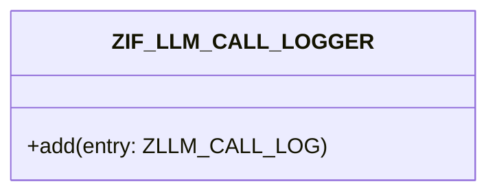

# Interface ZIF_LLM_CALL_LOGGER

AI Generated documentation.
## Overview
Interface `ZIF_LLM_CALL_LOGGER` provides logging functionality for LLM (Large Language Model) calls. It exposes a single method:

- `ADD`: Adds a new entry to the call log, accepting a parameter of type `ZLLM_CALL_LOG`

## Dependencies
- Data type `ZLLM_CALL_LOG` for log entry structure

