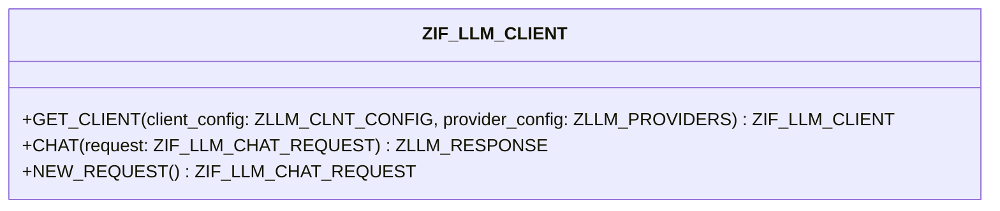

# Interface ZIF_LLM_CLIENT

AI Generated documentation.

## Overview

The `ZIF_LLM_CLIENT` interface provides functionality to interact with Large Language Models (LLM). It offers the following key methods:

- `GET_CLIENT` (static): Creates a new LLM client based on provided configuration
- `CHAT`: Executes chat requests with the LLM
- `NEW_REQUEST`: Creates a new chat request object

The interface defines standard role constants for LLM interactions:

- `ROLE_USER`
- `ROLE_SYSTEM`
- `ROLE_ASSISTANT`
- `ROLE_TOOL`

## Dependencies

- `ZIF_LLM_CHAT_REQUEST` - Interface for chat requests
- `ZCX_LLM_VALIDATION` - Exception class for validation errors
- `ZCX_LLM_AUTHORIZATION` - Exception class for authorization errors
