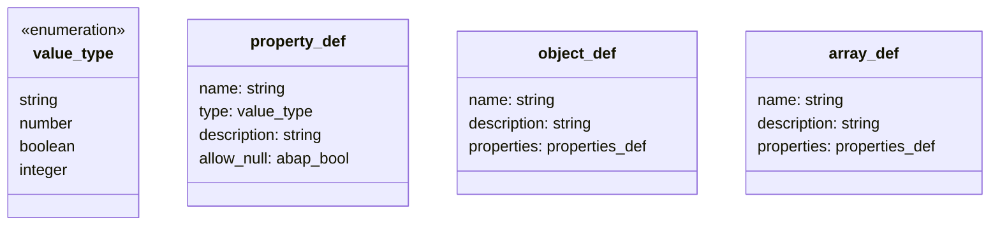

# Interface ZIF_LLM_CLIENT_JSON_SCHEMA

AI Generated documentation.

## Overview

The `ZIF_LLM_CLIENT_JSON_SCHEMA` interface provides functionality to build JSON schema definitions programmatically. It supports creating schemas with properties, arrays and objects with single-level nesting.

Key methods:

- `NEW_FORMAT`: Creates a new schema instance with a given title
- `ADD_PROPERTY`: Adds a single property to the schema
- `ADD_ARRAY`: Adds an array definition
- `ADD_OBJECT`: Adds an object definition
- `GENERATE_SCHEMA`: Generates the final JSON schema string

The interface defines several data types:

## Dependencies

- `ZCX_LLM_VALIDATION`: Exception class for validation errors
