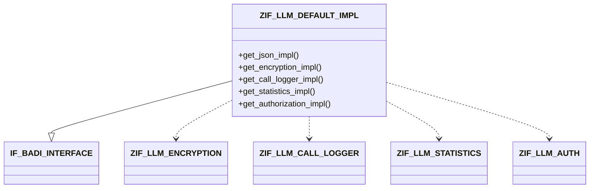

# Interface ZIF_LLM_DEFAULT_IMPL

AI Generated documentation.

## Overview

The interface `ZIF_LLM_DEFAULT_IMPL` provides methods to retrieve various implementation classes for an LLM (Large Language Model) system. It implements the BAdI interface `IF_BADI_INTERFACE` and defines the following key methods:

- `get_json_impl()` - Returns the name of the JSON handling class
- `get_encryption_impl()` - Returns the encryption provider implementation
- `get_call_logger_impl()` - Returns the call logging implementation
- `get_statistics_impl()` - Returns the statistics handling implementation  
- `get_authorization_impl()` - Returns the authorization implementation (raises `ZCX_LLM_AUTHORIZATION` for auth errors)

## Dependencies

The interface has dependencies on the following components:

- `IF_BADI_INTERFACE` - Standard SAP BAdI interface
- `ZIF_LLM_ENCRYPTION` - Encryption provider interface
- `ZIF_LLM_CALL_LOGGER` - Call logging interface
- `ZIF_LLM_STATISTICS` - Statistics interface
- `ZIF_LLM_AUTH` - Authorization interface
- `ZCX_LLM_AUTHORIZATION` - Authorization exception class

