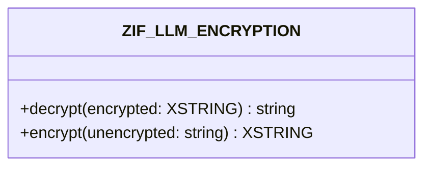

# Interface ZIF_LLM_ENCRYPTION

AI Generated documentation.
## Overview
The `ZIF_LLM_ENCRYPTION` interface provides encryption and decryption capabilities through two public methods:

- `DECRYPT`: Converts encrypted data (XSTRING) into a decrypted string
- `ENCRYPT`: Converts an unencrypted string into encrypted data (XSTRING)

Both methods can raise the following exceptions:
- `ZCX_LLM_VALIDATION`
- `ZCX_LLM_AUTHORIZATION` 

## Dependencies
- `ZCX_LLM_VALIDATION` exception class
- `ZCX_LLM_AUTHORIZATION` exception class

