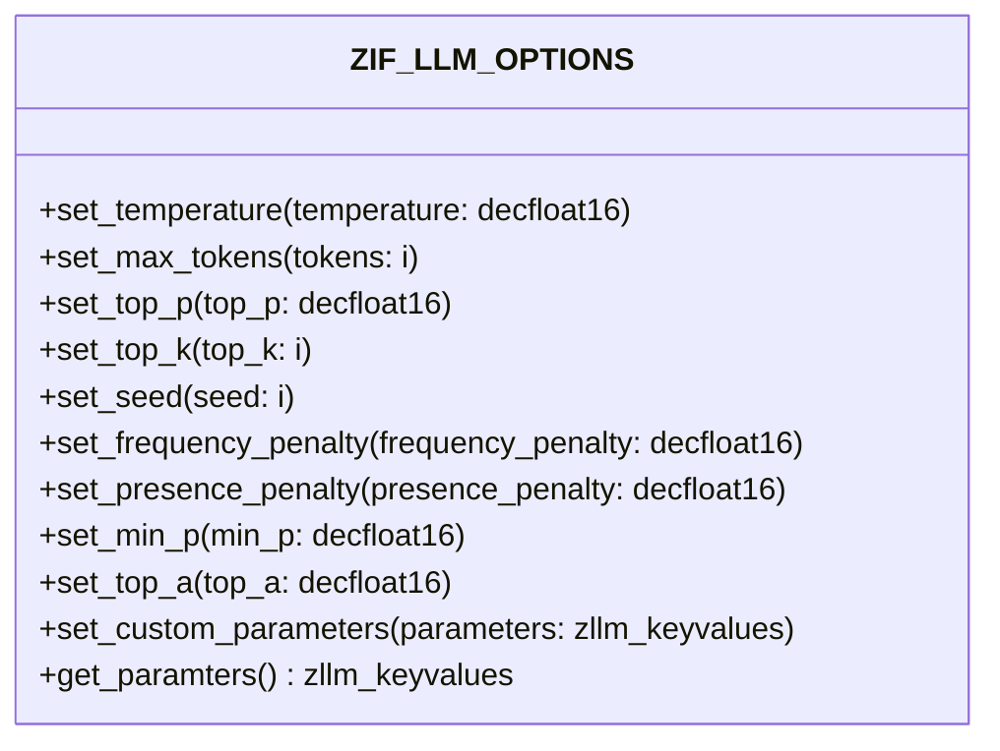

# Interface ZIF_LLM_OPTIONS

AI Generated documentation.

## Overview

The interface `ZIF_LLM_OPTIONS` provides methods to configure parameters for Large Language Model (LLM) calls. It offers setters for common LLM parameters with validation:

Key methods:

- Temperature control (range 0-2)
- Token limit setting (positive integers)
- Various sampling parameters (top_p, top_k, min_p, top_a)
- Penalty controls for frequency and presence (range -2 to 2)
- Seed setting for reproducible results
- Custom parameter handling

All setter methods include validation and can raise `ZCX_LLM_VALIDATION` exceptions.

## Dependencies

- `ZCX_LLM_VALIDATION` - Exception class for parameter validation
- `ZLLM_KEYVALUES` - Type for key-value parameter storage
