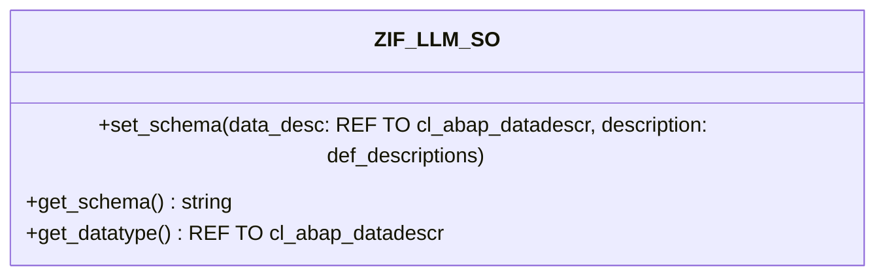

# Interface ZIF_LLM_SO

AI Generated documentation.
## Overview
The `ZIF_LLM_SO` interface provides functionality for handling structured output schemas. It offers three main methods:

- `SET_SCHEMA`: Configures the schema based on an ABAP data descriptor and optional field descriptions
- `GET_SCHEMA`: Retrieves the converted schema as a string
- `GET_DATATYPE`: Returns the internal data type definition

The interface defines a structured type `DEF_DESCRIPTION` and corresponding table type `DEF_DESCRIPTIONS` for providing field metadata like descriptions and enumeration values.

## Dependencies
- `CL_ABAP_DATADESCR`: Core ABAP runtime type description class
- `ZCX_LLM_VALIDATION`: Custom exception class for validation errors

