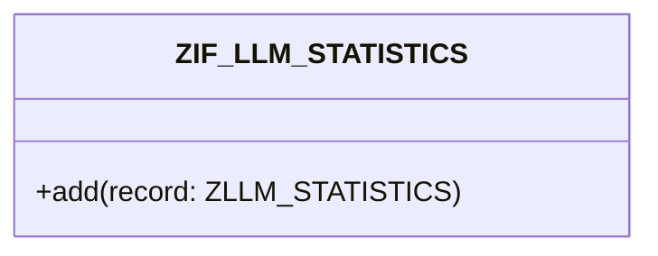

# Interface ZIF_LLM_STATISTICS

AI Generated documentation.
## Overview
The `ZIF_LLM_STATISTICS` interface provides functionality to record LLM (Large Language Model) statistics. It exposes one public method:

- `ADD`: Adds a single statistic record of type `ZLLM_STATISTICS`

## Dependencies
- Data type `ZLLM_STATISTICS` (statistics record structure)

