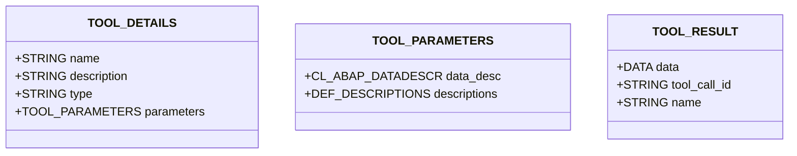

# Interface ZIF_LLM_TOOL

AI Generated documentation.
## Overview
The `ZIF_LLM_TOOL` interface defines a contract for implementing tool calls in an SAP ABAP LLM (Large Language Model) context. It provides three main methods:

- `GET_RESULT`: Retrieves the result of a tool call
- `GET_TOOL_DETAILS`: Returns metadata about the tool including name, description, and parameters
- `EXECUTE`: Executes the tool with given input data and returns the result

The interface uses structured types to handle tool parameters and results:

## Dependencies
- `CL_ABAP_DATADESCR`: ABAP Runtime Type Services
- `ZIF_LLM_TOOL_PARSER`: Interface for tool parameter parsing

