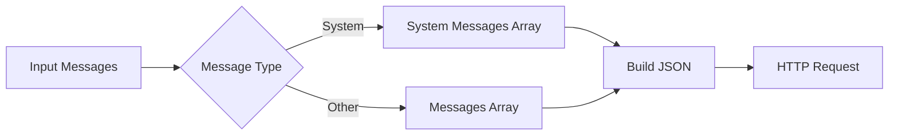
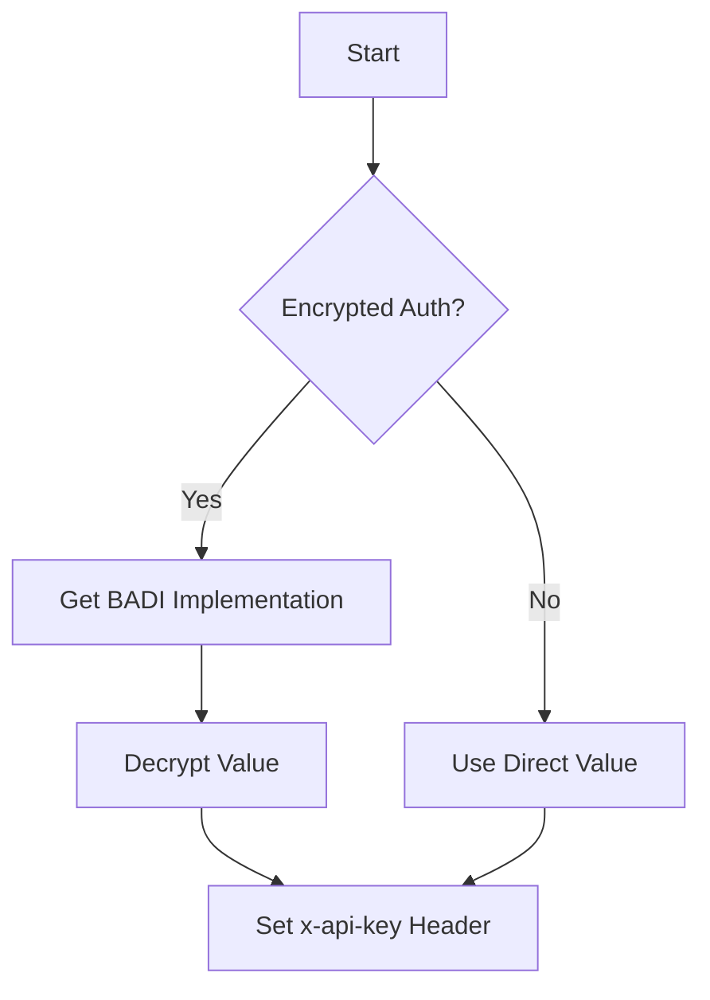

# Class ZCL_LLM_CLIENT_ANTHROPIC

AI Generated documentation.
## Overview
The `ZCL_LLM_CLIENT_ANTHROPIC` class implements a client for the Anthropic LLM API, inheriting from `ZCL_LLM_CLIENT_BASE`. It handles communication with Anthropic's API endpoints for chat completions.

Public methods:
- `GET_CLIENT`: Factory method returning a new client instance
- `CONSTRUCTOR`: Initializes a new client instance with given configuration
- `NEW_REQUEST`: Creates a new chat request with Anthropic-specific defaults (max tokens 8192)

## Dependencies
- Parent class: `ZCL_LLM_CLIENT_BASE`
- HTTP client wrapper: `ZCL_LLM_HTTP_CLIENT_WRAPPER`
- Configuration structures: `ZLLM_CLNT_CONFIG`, `ZLLM_PROVIDERS`
- JSON parser: `/UI2/CL_JSON`
- Encryption BADI: `ZCL_LLM_COMMON=>GET_LLM_BADI`

## Details
The class handles specific requirements of the Anthropic API:

1. Message Processing

2. Authentication Flow

Key implementation details:
- Handles system messages separately from other message types
- Supports tool definitions and tool calls
- Parses Anthropic-specific response format including usage metrics
- Implements structured error handling with retriable status detection
- Sets required API version header (2023-06-01)

