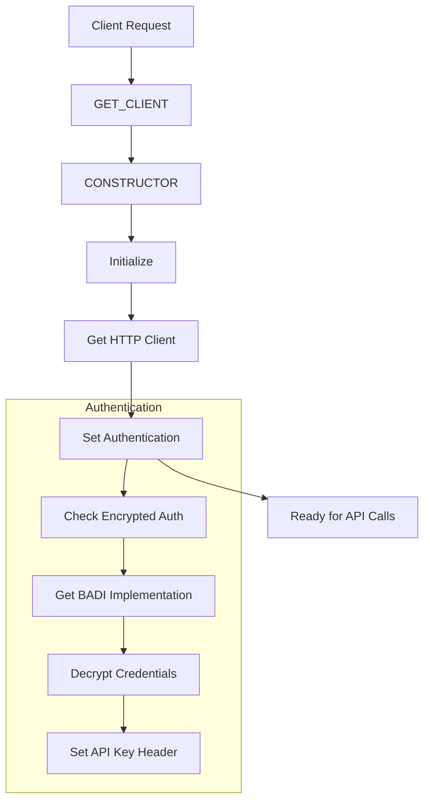

# Class ZCL_LLM_CLIENT_AZUREOAI

AI Generated documentation.

## Overview

The `ZCL_LLM_CLIENT_AZUREOAI` class implements a client for Azure OpenAI services, inheriting from `ZCL_LLM_CLIENT_BASE`. It provides functionality to interact with Azure's AI services through their API.

Public methods:

- `GET_CLIENT`: Factory method that creates and returns a new Azure OpenAI client instance
- `CONSTRUCTOR`: Initializes a new client instance with provided client and provider configurations

The class handles authentication and endpoint management for Azure OpenAI API calls with API version 2024-10-21.

## Dependencies

- Parent class: `ZCL_LLM_CLIENT_BASE`
- `ZCL_LLM_HTTP_CLIENT_WRAPPER`: For HTTP client handling
- `ZCL_LLM_COMMON`: For BADI implementation access
- `ZCL_LLM_SO_JS_AZUREOAI`: For structured output handling

## Details

The class implements a specific client for Azure OpenAI services with the following key aspects:

1. Authentication handling through encrypted credentials
2. HTTP client management
3. Endpoint construction for chat completions

The authentication process uses a BADI implementation for credential decryption, supporting API key authentication type ('A'). The chat endpoint is constructed dynamically using the provider model and a fixed API version, following the pattern: `/{model}/chat/completions?api-version={version}`.
