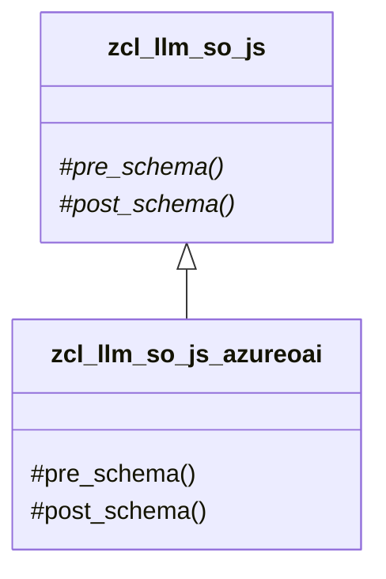
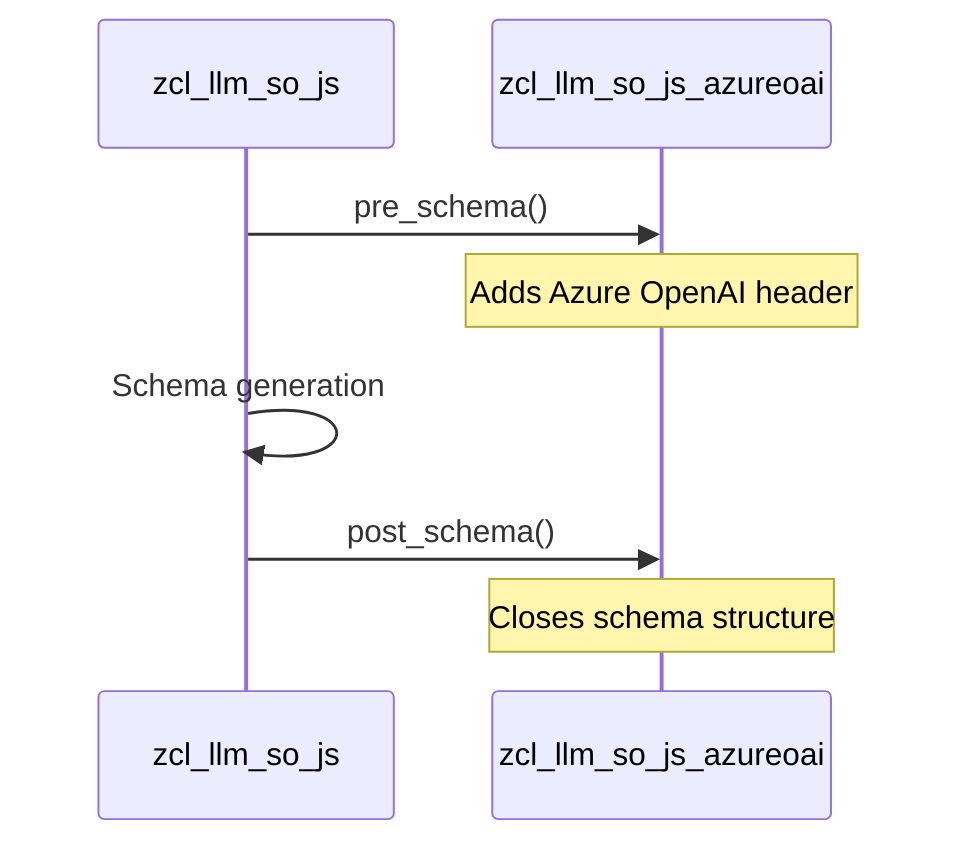

# Class ZCL_LLM_SO_JS_AZUREOAI

AI Generated documentation.
## Overview
This class implements JSON schema handling for Azure OpenAI responses. It inherits from `zcl_llm_so_js` and provides specialized schema wrapping functionality. The class has no public methods as it only redefines protected methods from its parent class.

## Dependencies
- Inherits from `zcl_llm_so_js`

## Details
The class provides a specific JSON schema implementation for Azure OpenAI responses by wrapping the schema content with required Azure OpenAI specific elements:

- `pre_schema`: Adds the opening wrapper including name, strict mode flag and schema opening
- `post_schema`: Closes the schema structure

The schema generation follows this sequence:

