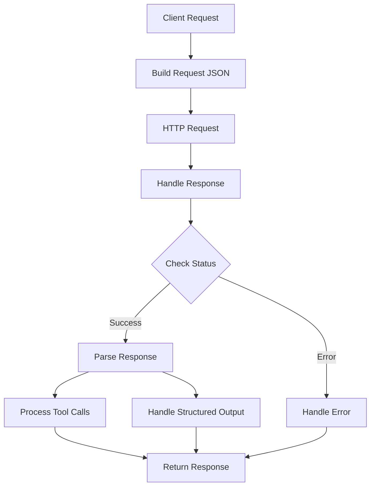

# Class ZCL_LLM_CLIENT_OLLAMA

AI Generated documentation.

## Overview

The `ZCL_LLM_CLIENT_OLLAMA` class implements a client for interacting with Ollama LLM services. It inherits from `ZCL_LLM_CLIENT_BASE` and provides specialized handling for Ollama-specific features.

Public methods:

- `get_client`: Factory method that creates and returns a new Ollama client instance
- `constructor`: Initializes the Ollama client with client and provider configurations

The class handles:

- Authentication via optional API keys
- Request/response formatting specific to Ollama
- Structured output processing
- Tool calls management
- Message parsing and formatting

## Dependencies

- Parent class: `ZCL_LLM_CLIENT_BASE`
- `ZCL_LLM_HTTP_CLIENT_WRAPPER`: For HTTP communication
- `ZCL_LLM_COMMON`: Utility class for JSON handling
- BAdI implementation for encryption handling

## Details

The class implements a specialized HTTP client for Ollama with focus on proper request/response handling:

Key implementation aspects:

- Supports streaming control via `stream` parameter
- Handles Ollama-specific format parameters for structured output
- Implements custom options handling in Ollama format
- Provides detailed error handling with retry capabilities for rate limits and timeouts
- Processes tool calls with argument parsing and validation
- Supports encrypted authentication via custom headers
