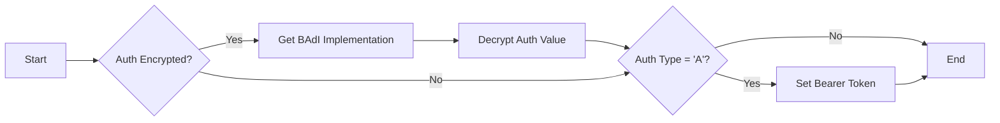

# Class ZCL_LLM_CLIENT_OPENAI

AI Generated documentation.
## Overview
The `ZCL_LLM_CLIENT_OPENAI` class implements a client for OpenAI's API services. It inherits from `ZCL_LLM_CLIENT_BASE` and provides functionality to:

- Create OpenAI client instances via the factory method `GET_CLIENT`
- Handle authentication with OpenAI's API
- Configure HTTP endpoints and client settings

Public methods:
- `GET_CLIENT`: Factory method returning a configured OpenAI client instance
- `CONSTRUCTOR`: Initializes a new client instance with provided configurations

## Dependencies
- Parent class: `ZCL_LLM_CLIENT_BASE`
- Interface: `ZIF_LLM_CLIENT`
- Helper class: `ZCL_LLM_HTTP_CLIENT_WRAPPER`
- BAdI: `ZCL_LLM_COMMON=>GET_LLM_BADI`
- Structured output class: `ZCL_LLM_SO_JS_OA`

## Details
The class implements OpenAI-specific handling of:
- Authentication using Bearer tokens
- Endpoint configuration pointing to '/chat/completions'
- Encrypted authentication data processing

Authentication flow:

The class follows a factory pattern for instantiation, ensuring proper configuration and initialization of OpenAI clients. It handles the specifics of OpenAI's API requirements while abstracting the implementation details from the consuming code.

