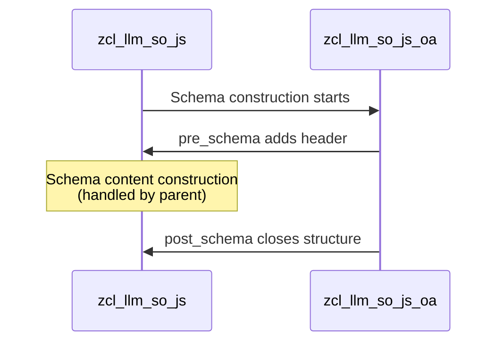

# Class ZCL_LLM_SO_JS_OA

AI Generated documentation.
## Overview
This class implements OpenAI-specific JSON schema handling by inheriting from `zcl_llm_so_js`. It provides a specialized framework for constructing JSON schemas specifically formatted for OpenAI interactions. The class has no public methods but overrides protected methods from its parent class to add OpenAI-specific schema wrapping.

## Dependencies
- Inherits from base class `zcl_llm_so_js`

## Details
The class implements a specific JSON schema structure required for OpenAI by wrapping the schema content with required OpenAI-specific elements:

- `pre_schema`: Adds the opening structure including name, strict mode flag, and schema opening
- `post_schema`: Closes the schema structure

The schema construction follows this pattern:



The resulting schema follows this structure:
```json
{
  "name": "Response",
  "strict": true,
  "schema": {
    // schema content from parent class
  }
}
```

