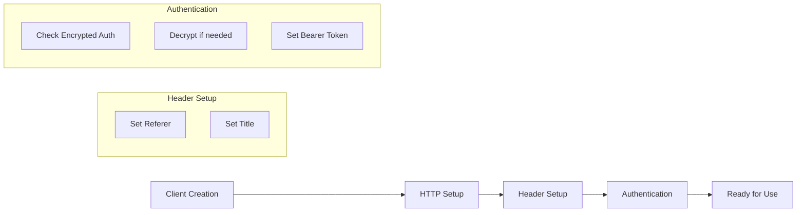

# Class ZCL_LLM_CLIENT_OPENROUTER

AI Generated documentation.

## Overview

The `ZCL_LLM_CLIENT_OPENROUTER` class implements a client for the OpenRouter LLM service, inheriting from `ZCL_LLM_CLIENT_BASE`. It provides functionality to:

- Create client instances via the factory method `GET_CLIENT`
- Handle authentication with OpenRouter API
- Set specific HTTP headers required by OpenRouter
- Configure chat completion endpoints

Public methods:

- `GET_CLIENT`: Factory method returning a configured OpenRouter client instance
- `CONSTRUCTOR`: Initializes a new client instance with given configurations

## Dependencies

- Parent class: `ZCL_LLM_CLIENT_BASE`
- Interface: `ZIF_LLM_CLIENT`
- Helper class: `ZCL_LLM_HTTP_CLIENT_WRAPPER`
- BAdI: `ZCL_LLM_COMMON=>GET_LLM_BADI`

## Details

The class implements specific OpenRouter requirements:

Key implementation aspects:

- Uses '/chat/completions' as endpoint
- Sets OpenRouter-specific headers:
  - HTTP-Referer: '<https://abap-ai.com>'
  - X-Title: 'ABAP LLM Client'
- Supports encrypted authentication through a BAdI implementation
- Creates structured output using `ZCL_LLM_SO_JS_OR` class

The authentication process handles encrypted credentials through a pluggable encryption implementation, making the security approach flexible and extensible.
