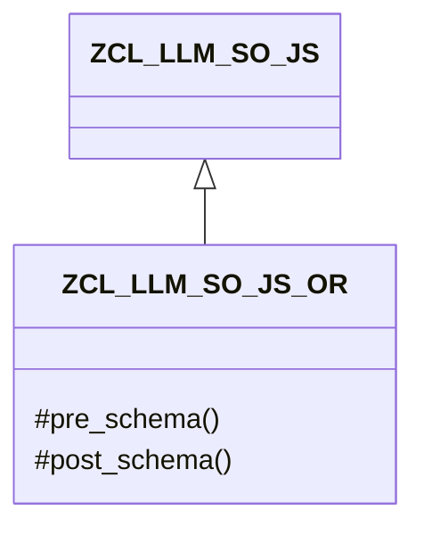

# Class ZCL_LLM_SO_JS_OR

AI Generated documentation.
## Overview
This class extends `ZCL_LLM_SO_JS` and provides JSON schema handling functionality. It specifically handles the outer structure of a JSON schema by adding opening and closing elements for a strict response schema. The class has no public methods, only redefined protected methods from its parent class.

## Dependencies
- Inherits from `ZCL_LLM_SO_JS`

## Details
The class implements a specific JSON schema structure by redefining two methods from its parent class:

The schema generation follows this pattern:
1. `pre_schema`: Adds the opening structure defining a strict response schema with `"name":"Response","strict":true,"schema":{`
2. Parent class likely handles the schema content
3. `post_schema`: Closes the schema structure with `}`

This creates a complete JSON schema envelope around the actual schema content that is handled by the parent class.

