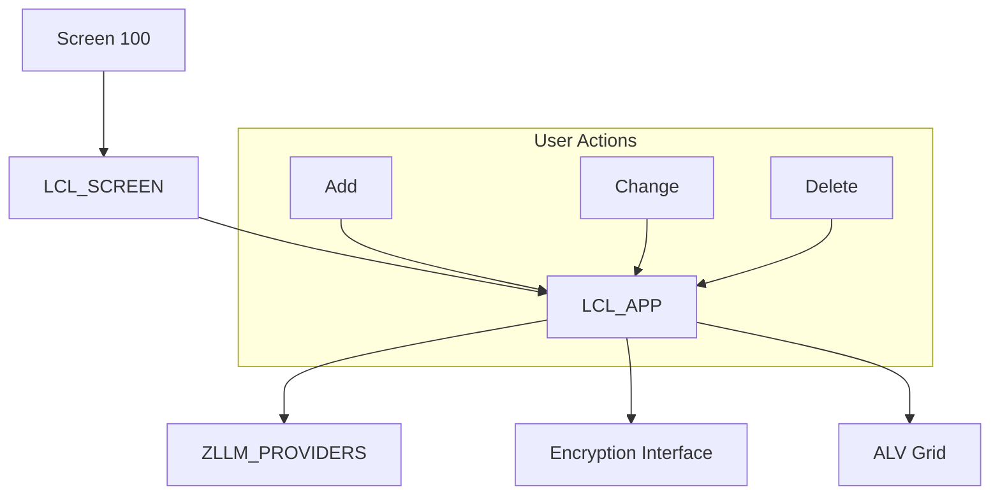

# Report ZLLM_PROVIDER_MAINTENANCE

AI Generated documentation.
## Overview
This ABAP report implements a maintenance application for LLM (Large Language Model) providers. It allows users to manage provider configurations through a GUI that offers the following main functions:
- Display providers in an ALV grid
- Add new provider configurations
- Change existing provider configurations
- Delete provider configurations

The code is structured into two main classes:
- `LCL_APP`: Core application logic handling provider data and encryption
- `LCL_SCREEN`: Screen management and user interaction handling

## Dependencies
- Table `ZLLM_PROVIDERS`: Stores provider configurations
- Interface `ZIF_LLM_ENCRYPTION`: Encryption functionality
- Class `ZCL_LLM_COMMON`: Provides access to LLM BADI
- ALV Grid (`CL_GUI_ALV_GRID`): Display framework
- Standard function modules for popups and field catalog creation

## Details
The application follows a typical ABAP object-oriented design pattern with clear separation between UI and business logic.

Key implementation aspects:
- Provider configurations include name, implementation class, RFC destination, and encrypted authentication
- Authentication values can exceed 132 characters and are handled by splitting them
- The application uses encrypted storage for authentication values
- ALV display is configured with custom field catalog excluding sensitive data
- User interaction is handled through standard SAP popups for data entry and confirmations
- Error handling is implemented for encryption/decryption operations

The data flow follows this pattern:
1. Load provider data from database
2. Display in ALV with masked sensitive information
3. User actions trigger corresponding handler methods
4. Changes are encrypted if necessary and persisted
5. Display is refreshed automatically

