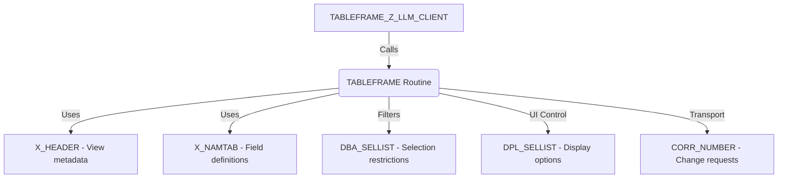

# Function Module TABLEFRAME_Z_LLM_CLIENT

AI Generated documentation.

## Overview  

Core function module for maintaining a custom view (`Z_LLM_CLIENT`) via SAP's table maintenance framework. Centered around the standard `TABLEFRAME` routine that provides generic view maintenance capabilities. Acts as an interface between custom configurations and SAP's view maintenance engine.

Key components:

- Delegates all logic to standard `TABLEFRAME` function
- Handles view maintenance operations (display, update, transport)
- Uses standard maintenance dialog structures

## Dependencies  

- SAP standard components:  
  - `TABLEFRAME` routine (core maintenance logic)
  - Structures: `X_HEADER` (view metadata), `X_NAMTAB` (field catalog)
  - Transport system integration via `CORR_NUMBER`

## Details  

### Parameter Flow  



### Key Implementation Notes  

1. **View-Specific Configuration**:  
   `VIEW_NAME` parameter hardcodes the association with maintenance view `Z_LLM_CLIENT`

2. **Authorization Flow**:  
   Inherits standard authorization checks from `TABLEFRAME` via `EXCL_CUA_FUNCT` (excluded functions control)

3. **Data Flow**:  

   ```mermaid
   sequenceDiagram
       User->>+FM: Initiate view maintenance
       FM->>+TABLEFRAME: Pass view configuration
       TABLEFRAME-->>-FM: Return maintenance dialog
       FM-->>-User: Display maintenance UI
       User->>TABLEFRAME: Perform data changes
       TABLEFRAME->>Database: Commit via standard checks
   ```

4. **Transport Integration**:  
   Changes are recorded via `CORR_NUMBER` parameter that connects to SAP's transport management system

5. **Table Control**:  
   `DBA_SELLIST` restricts data access at database level while `DPL_SELLIST` controls field visibility in UI
