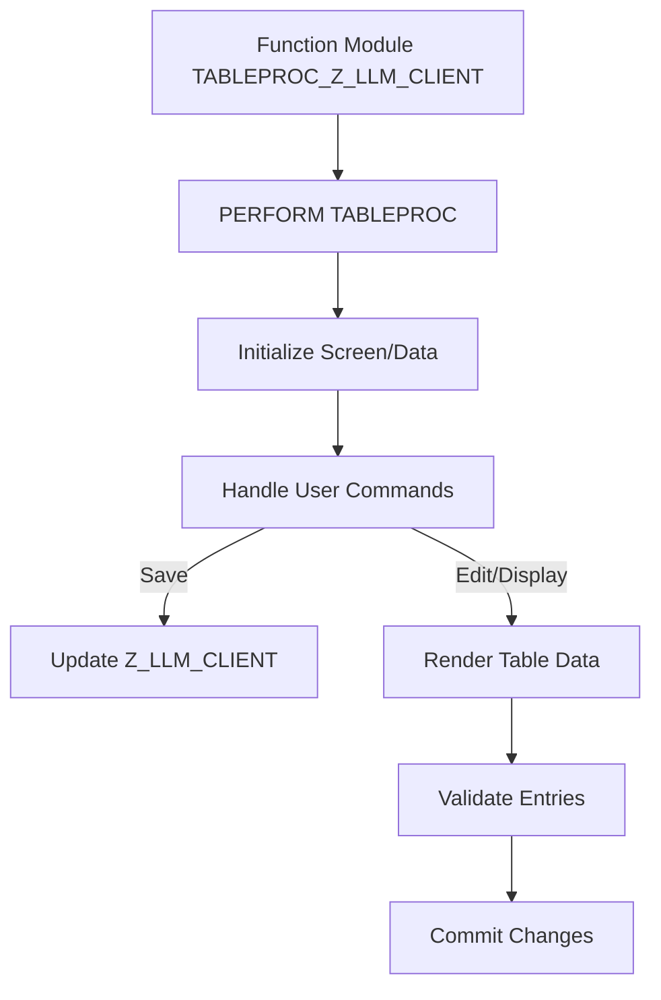

# Function Module TABLEPROC_Z_LLM_CLIENT

AI Generated documentation.

## Overview  

The function module `TABLEPROC_Z_LLM_CLIENT` serves as the **standard table maintenance dialog processor** for the database table `Z_LLM_CLIENT`. It is auto-generated (likely via the SAP View Maintenance Generator, transaction `SE54`) to enable maintenance of table entries via transaction `SM30`. The core logic delegates processing to the subroutine `TABLEPROC`, which handles standard operations like data display, editing, saving, and consistency checks.  

## Details  

### Logic Flow  

The function module acts as an entry point, invoking the subroutine `TABLEPROC`. This subroutine orchestrates:  

1. **Mode Handling**: Manages display/edit modes.  
2. **Data Retrieval/Update**: Fetches data from `Z_LLM_CLIENT` and writes changes back.  
3. **Authorization Checks**: Validates user permissions (if configured).  
4. **Event Processing**: Responds to user actions (e.g., saving, sorting, filtering).  

### Key Interactions  

- **Table Maintenance Generator**: The code is generated and maintained via SAP tools (e.g., `SE54`). Manual modifications may be overwritten during regeneration.  
- **Subroutine Pool**: The `TABLEPROC` subroutine resides in an include program linked to the function group of `Z_LLM_CLIENT`.  
- **Standard SAP Logic**: Relies on SAP-internal routines for UI rendering, data consistency, and transactional handling (e.g., `SM30` framework).  

### Notes for Developers  

- **Custom Enhancements**: Use `CMOD`/`SMOD` or `BAdI` enhancements to inject custom logic (e.g., validations) without modifying the generated code directly.  
- **Authorization Objects**: If required, configure authorization checks via the maintenance generator.
