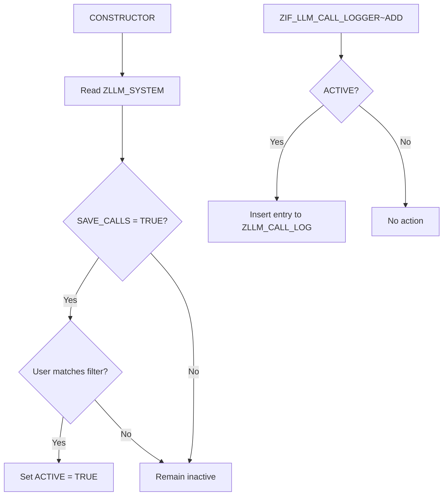

# Class ZCL_LLM_CALL_LOGGER

AI Generated documentation.

## Overview

The class `ZCL_LLM_CALL_LOGGER` implements logging functionality for LLM (Large Language Model) interactions. It provides conditional logging controlled by system configuration and user-based filtering.

**Public Methods**:

- `ZIF_LLM_CALL_LOGGER~ADD`:  
  Inserts a log entry into `ZLLM_CALL_LOG` only if logging is enabled for the current context
- `CONSTRUCTOR`:  
  Initializes activation state by checking configuration from `ZLLM_SYSTEM`

Key features:

- Activation controlled by `ZLLM_SYSTEM` configuration
- User-specific logging using wildcard/exact match filters
- Automatic population of technical fields (timestamp/user) via database defaults

## Dependencies

**Database Tables**:

- `ZLLM_SYSTEM`: Stores activation flag (`SAVE_CALLS`) and user filter (`CALL_FILTER_UNAME`)
- `ZLLM_CALL_LOG`: Target table for log entries with technical fields `CREATED_AT`/`CREATED_BY`

## Details

**Key Implementation Notes**:

1. **Activation Logic**:
   - Combines system-level activation (`SAVE_CALLS`) with user filter (`CALL_FILTER_UNAME`)
   - Uses `SY-UNAME` for runtime user context comparison

2. **Database Integration**:
   - Technical fields (`CREATED_AT`, `CREATED_BY`) are managed through database defaults
   - No explicit field mapping in INSERT operation - relies on table structure

3. **Test Strategy**:
   - Uses `CL_OSQL_TEST_ENVIRONMENT` for in-memory test doubles
   - Complete isolation between test cases via `CLEAR_DOUBLES()`
   - Verifies parameter handling through test-specific entry structures

**Performance Considerations**:

- Single `SELECT SINGLE` during object instantiation
- No database operations when logging is inactive
- User filter evaluation occurs once per logger instance
