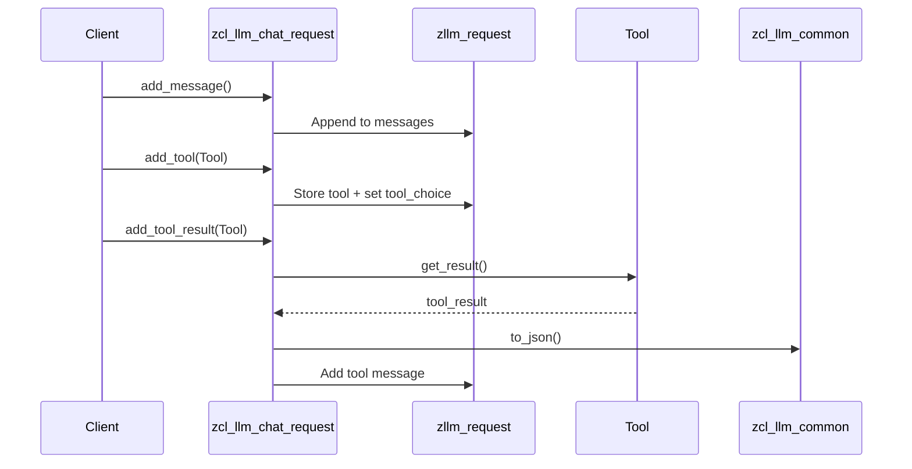

# Class ZCL_LLM_CHAT_REQUEST

AI Generated documentation.

## Overview

The `zcl_llm_chat_request` class implements LLM chat request management through interface `zif_llm_chat_request`, providing structured message/tool handling and configuration for AI interactions.

**Core Functionality:**

- Message management: Add/clear individual or bulk messages
- Tool integration: Register tools and handle tool execution results
- Request configuration: Control response formatting and tool selection behavior

**Public Methods:**

| Category          | Methods                                                                 |
|-------------------|-------------------------------------------------------------------------|
| Message Handling  | `add_message`, `add_messages`, `clear_messages`, `add_tool_choice`      |
| Tool Management   | `add_tool`, `add_tools`, `add_tool_result`, `clear_tools`              |
| Configuration     | `set_tool_choice`, `set_structured_output_active`                      |
| Data Access       | `get_internal_request`, `get_messages`, `get_tools`, `options`         |

## Dependencies

- Interface: `zif_llm_client` (role constants)
- Utility Class: `zcl_llm_common` (JSON conversion)
- Data Structure: `zllm_request` (core container type)
- Interface: `zif_llm_chat_request` (implemented contract)

## Details



**Key Implementation Aspects:**

1. **State Preservation:** Maintains complete request context in `zllm_request` structure including:
   - Message history with role metadata
   - Registered tools with automatic tool_choice updates
   - Structured output configuration flags

2. **Tool Result Handling:**

   ```abap
   METHOD add_tool_result.
     DATA(tool_result) = tool->get_result().  // Dynamic interface binding
     APPEND VALUE #(role = zif_llm_client=>role_tool,
                   content = zcl_llm_common=>to_json(...))  // Structured JSON conversion
   ENDMETHOD.
   ```

3. **Validation Patterns:**
   - Automatic role assignment for tool responses (`role_tool`)
   - Tool call ID propagation through message chain
   - Immutable request export via `get_internal_request`

4. **Configuration Cascade:**

   ```plaintext
   set_tool_choice(AUTO) -> Affects subsequent tool registrations
   set_structured_output_active -> Forces JSON schema validation
   add_tool_choice -> Creates assistant role message with tool calls
   ```
