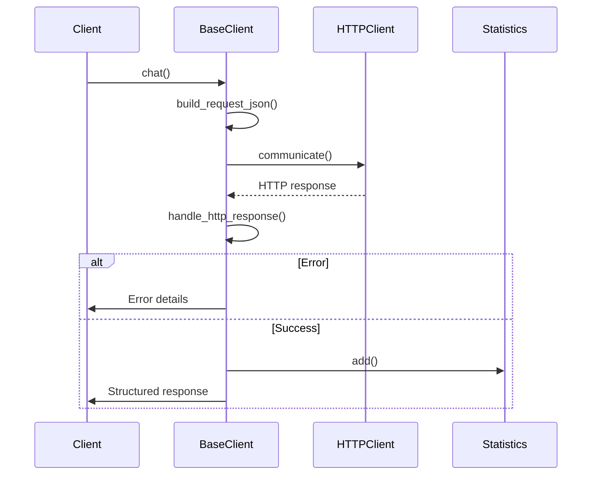

# Class ZCL_LLM_CLIENT_BASE

AI Generated documentation.

## Overview  

Base abstract class for LLM client implementations providing common functionality for:

- HTTP communication handling
- Structured JSON request/response processing
- Tool call integrations
- Statistics tracking

**Key Public Methods**:  

| Method | Description |  
|--------|-------------|  
| `CONSTRUCTOR` | Initializes client with provider/config data and UUID generation |  
| `ZIF_LLM_CLIENT~CHAT` | Main method for executing LLM requests with full processing chain |  
| `ZIF_LLM_CLIENT~NEW_REQUEST` | Creates preconfigured request object with default options |  
| `ZIF_LLM_CLIENT~GET_CLIENT` | Factory method for provider-specific client instances |  

## Dependencies  

Main external components:  

- Interfaces:  
  `ZIF_LLM_HTTP_CLIENT_WRAPPER` (HTTP communication)  
  `ZIF_LLM_TOOL_PARSER` (Tool schema processing)  
  `ZIF_LLM_STATISTICS` (Usage metrics tracking)  
- Exceptions:  
  `ZCX_LLM_VALIDATION`  
  `ZCX_LLM_AUTHORIZATION`  

## Details  

### Main Processing Flow  



### Key Features  

1. **Structured Output Handling**  
   Uses `ZIF_LLM_SO` implementations for JSON schema validation:

   ```mermaid
   classDiagram
       class BaseClient {
           +parse_structured_output()
       }
       class ZIF_LLM_SO {
           <<interface>>
           +get_schema()
           +get_datatype()
       }
       BaseClient --> ZIF_LLM_SO : creates/uses
   ```

2. **Tool Call Processing**  
   Implements recursive tool call resolution:

   ```abap
   LOOP AT tool_calls
     TRY.
         PARSE arguments
         VALIDATE against tool schema
         APPEND to response
       CATCH ERROR
         HANDLE validation failures
   ```

3. **Request Building**  
   Combines multiple configuration sources:
   - Client-specific model parameters
   - Structured output requirements
   - Tool definitions with schema validation
   - Custom options (temperature, top_p etc.)

4. **Statistics Tracking**  
   Collects granular metrics through BAdI implementation:

   ```abap
   DATA(statistics) = BAdI->get_statistics_impl()
   statistics->add(
     call_date     = sy-datum
     call_time     = sy-uzeit
     duration      = measurement
     tokens        = usage metrics
   )
   ```

### Error Handling  

Implements retry logic for specific HTTP status codes:

- 429 (Too Many Requests)
- 408 (Timeout)  
Maintains error context with:
- HTTP status codes
- Provider-specific error messages
- Tool validation failures
