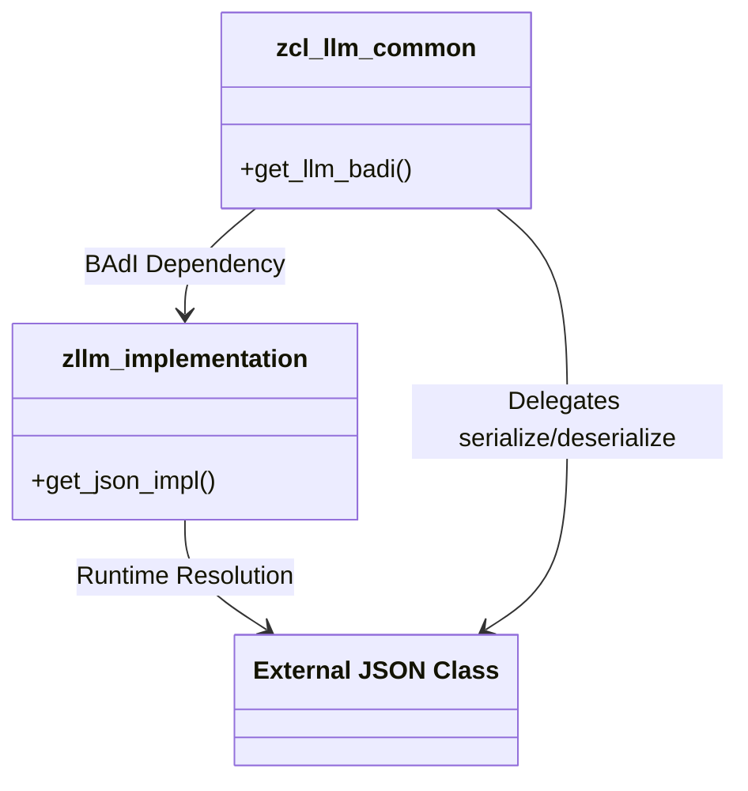
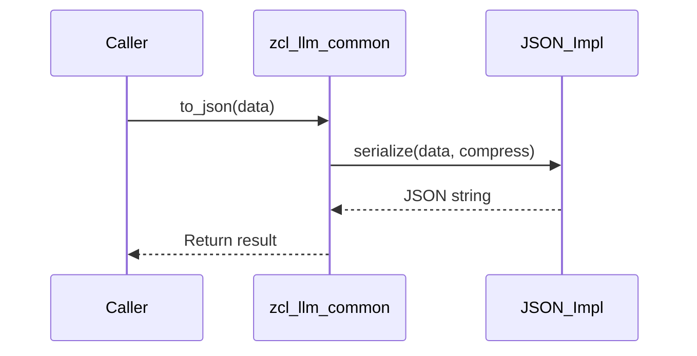

# Class ZCL_LLM_COMMON

AI Generated documentation.

## Overview  

The class `zcl_llm_common` provides utilities for JSON serialization/deserialization and integration with a custom LLM (Large Language Model) BAdI implementation. Its primary functions include:  

- **`TO_JSON`**: Converts ABAP data structures to JSON strings, supporting compression and lowercase key formatting.  
- **`FROM_JSON`**: Deserializes JSON strings into ABAP structures with field mapping.  
- **`GET_LLM_BADI`**: Returns a reference to the active LLM BAdI implementation.  
- Dynamic JSON handling via a BAdI-resolved implementation class.  

## Dependencies  

- **BAdI**: `zllm_implementation` for runtime JSON implementation resolution.  
- **JSON Library**: Delegates serialization/deserialization to a class (`json_class`) provided by the BAdI.  
- **Formatting Dependency**: Uses `/ui2/cl_json` for lowercase JSON property naming.  

## Details  

### Dynamic JSON Implementation  

The class defers JSON processing to an external implementation resolved during initialization:  

1. **Class Constructor**: Fetches the BAdI instance and resolves the JSON handler.  
2. **Loose Coupling**: Swapping JSON implementations (e.g., for performance or compliance) requires only BAdI reconfiguration.  

### Key Design Aspects  

- **Case Handling**: Forces lowercase JSON keys via `/ui2/cl_json=>pretty_mode-low_case` to ensure consistent property naming.  
- **BAdI Control**: The LLM BAdI acts as a central extension point for customizing JSON behavior or LLM integrations.  
- **Error Transparency**: Exceptions from the JSON implementation class propagate directly to callers.  

### Serialization Logic Flow  

- **Compression**: When enabled, removes whitespace from the output JSON.  
- **Type Preservation**: Relies on the JSON implementation to map ABAP types (e.g., `DATS`, `TIMS`) correctly.  

### Testing Implications  

- **BAdI Mocking**: Tests require a stubbed BAdI providing a test-safe JSON implementation.  
- **Roundtrip Stability**: Successful tests implicitly validate that the resolved JSON implementation supports symmetric conversions.  
- **Empty JSON Handling**: Explicit checks ensure edge cases like `{}` are not treated as errors.
