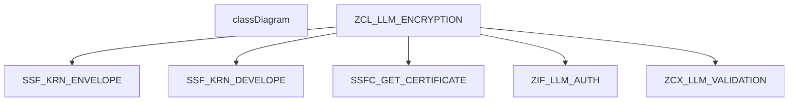
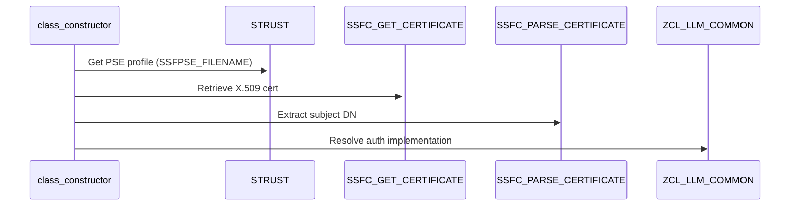

# Class ZCL_LLM_ENCRYPTION

AI Generated documentation.

## Overview  

The `ZCL_LLM_ENCRYPTION` class implements asymmetric cryptography using SAP's SSF framework (Secure Store & Forward). It provides public encryption/decryption methods via interface `ZIF_LLM_ENCRYPTION` with PSE (Personal Security Environment) integration.

**Key Public Methods**:  

- `ZIF_LLM_ENCRYPTION~ENCRYPT`:  
  Encrypts UTF-8 text using certificate-based envelope encryption via `SSF_KRN_ENVELOPE`. Handles chunking for large payloads (255-byte blocks).  

- `ZIF_LLM_ENCRYPTION~DECRYPT`:  
  Decrypts data using private key operations via `SSF_KRN_DEVELOPE`. Includes input validation and chunk reassembly.  

- `CLASS_CONSTRUCTOR`:  
  Initializes cryptographic environment: loads PSE profile, retrieves certificate, and configures SSF context.

## Dependencies  

1. **SSF Framework**: Critical dependency on function modules `SSF_KRN_ENVELOPE/DEVELOPE` and PSE management utilities (`SSFPSE_FILENAME`, `SSFC_*`)  
2. **Authorization**: Requires `ZIF_LLM_AUTH` implementation via BADI for permission checks  
3. **Exception Handling**: Uses `ZCX_LLM_VALIDATION` for error propagation  
4. **Configuration**: Relies on PSE profile configured in transaction `STRUST` with application ID `ZLLMCT`

## Details  

### Encryption Process Flow

1. Input validation & authorization check via `ZIF_LLM_AUTH`
2. UTF-8 conversion with `CL_BINARY_CONVERT`
3. Chunking logic using fixed 255-byte blocks (`BIN_LINE` constant)
4. Certificate-based encryption via `SSF_KRN_ENVELOPE`
5. Output concatenation in byte mode

### Decryption Process Flow  

1. Input length calculation with `XSTRLEN`
2. Chunked processing for SSF compatibility
3. Private key decryption via `SSF_KRN_DEVELOPE`
4. Buffer reconstruction using `REDUCE` operator
5. UTF-8 back conversion with length trimming

### Security Configuration

**Critical Implementation Notes**:  

- Uses empty password for PSE access (`str_pab_password = ''`) - requires external key management  
- Strict error handling: 11 SSF exception cases mapped to validation errors  
- Memory optimization: Avoids full data copies through chunked processing  
- XSTRING handling: Bypasses code page issues with byte-mode concatenation  
- Test coverage aligns with SAP cryptographic guidelines (empty values, buffer limits, round-trip verification)  

**Performance Considerations**:  

- Chunk size (`BIN_LINE=255`) matches SSF optimal payload recommendations  
- REDUCE operator in decryption minimizes temporary object creation  
- Authorization checks occur before resource-intensive crypto operations
