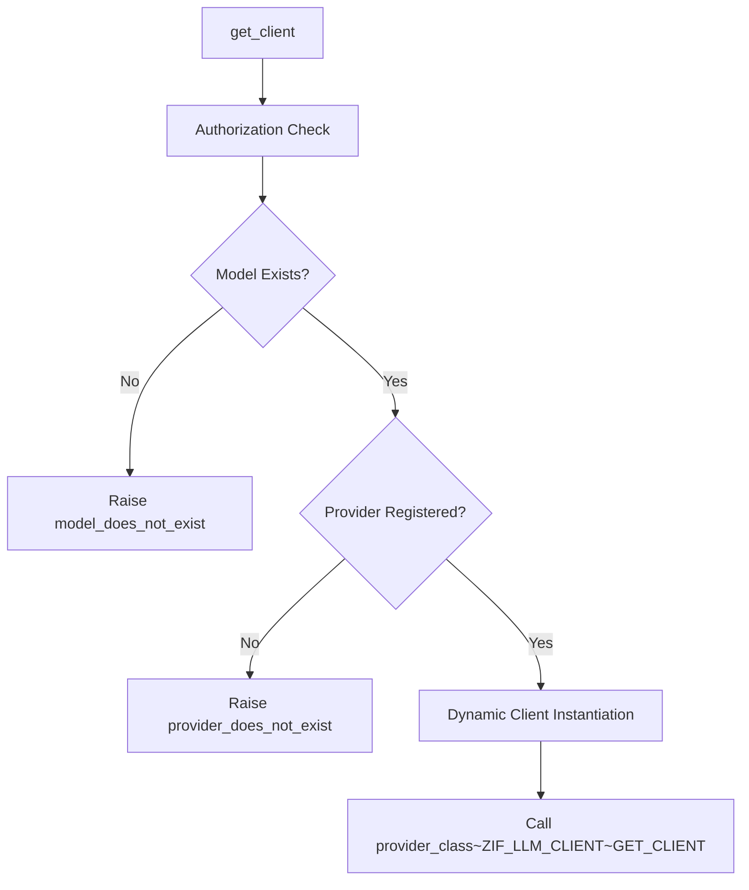

# Class ZCL_LLM_FACTORY

AI Generated documentation.

## Overview  

The `ZCL_LLM_FACTORY` class is a singleton factory responsible for creating LLM (Large Language Model) client instances based on configured models and providers. Its core functionality is exposed via the interface `ZIF_LLM_FACTORY`, with the key public method:  

- **`ZIF_LLM_FACTORY~GET_CLIENT`**:  
  Instantiates an LLM client for a specified model after validating:  
  1. Model configuration existence  
  2. Provider registration  
  3. Authorization (via injected `ZIF_LLM_AUTH` implementation)  
  Raises `ZCX_LLM_VALIDATION` exceptions for invalid configurations.  

The class initializes its authorization component during `CLASS_CONSTRUCTOR` via a BAdI implementation.  

## Dependencies  

- **Database tables**:  
  - `ZLLM_CLNT_CONFIG`: Stores model-to-provider mappings  
  - `ZLLM_PROVIDERS`: Registry of available LLM provider implementations  
- **Authorization**: BAdI-driven implementation of `ZIF_LLM_AUTH`  
- **Exception class**: `ZCX_LLM_VALIDATION` for error signaling  

## Details  

**Key implementation characteristics**:  

1. **Dynamic Client Creation**:  
   Uses runtime method call `(provider_class)=>ZIF_LLM_CLIENT~GET_CLIENT` to decouple factory from concrete implementations.  

2. **Validation Sequence**:  
   - Authorization precedes model validation, indicating potential security-first design  
   - Provider check uses model's configured provider name from `ZLLM_CLNT_CONFIG`  

3. **Test Critical Points**:  
   - Database table integrity (as shown in test double configuration)  
   - Exception type differentiation through `ZCX_LLM_VALIDATION` subtypes  
   - Provider implementation registry consistency  

**Security Integration**:  
Authorization implementation is resolved via `ZCL_LLM_COMMON=>GET_LLM_BADI( )`, allowing flexible authentication/authorization strategies without factory modification.
