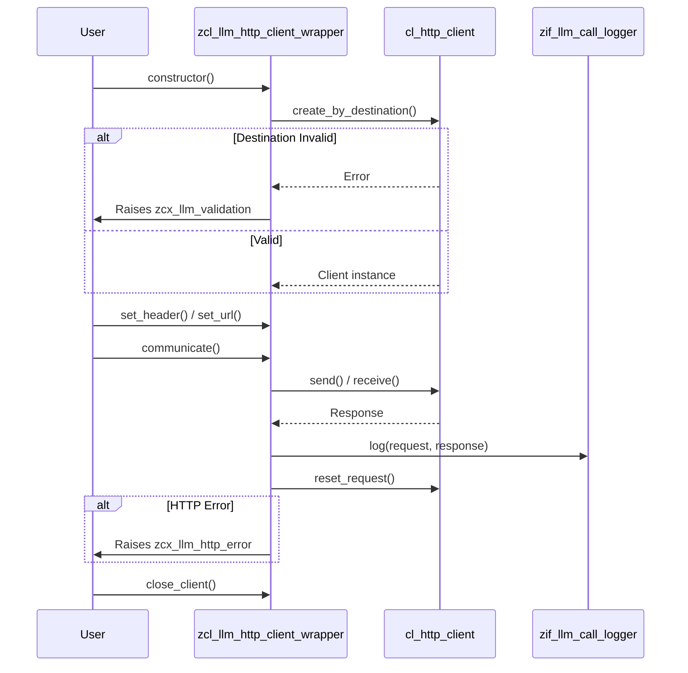

# Class ZCL_LLM_HTTP_CLIENT_WRAPPER

AI Generated documentation.

## Overview  

The `zcl_llm_http_client_wrapper` class provides a configurable abstraction layer for HTTP communication, tailored for integration with Large Language Model (LLM) services. It encapsulates the lifecycle management of an HTTP client, header/URL configuration, request execution, and error handling.  

**Public Methods**:  

- **`constructor`**: Initializes the HTTP client using an RFC destination and validates its configuration. Raises `zcx_llm_validation` on errors.  
- **`get_client`**: Factory method to create a new client wrapper instance.  
- **`set_header`**: Assigns custom HTTP headers (e.g., API keys, authorization tokens).  
- **`set_url`**: Configures the target endpoint URL.  
- **`communicate`**: Executes the HTTP POST request, processes the response, logs the interaction, and handles errors.  
- **`close_client`**: Safely terminates the HTTP client connection.  

## Dependencies  

- **`cl_http_client`**: Core SAP HTTP client for communication.  
- **`zcx_llm_validation` / `zcx_llm_http_error`**: Custom exceptions for configuration/communication errors.  
- **`zif_llm_call_logger`**: Interface for logging API requests/responses.  
- **`zllm_clnt_config` / `zllm_providers`**: Configuration structures for client/provider settings.  

## Details  

### Key Logic Flow  

### Critical Implementation Aspects  

1. **Header Management**:  
   - Non-SAP headers (e.g., `Authorization`) are preserved across requests via `get_header_fields` and `set_header_fields` to avoid losing context (e.g., API keys).  
   - SAP-internal headers (prefixed with `~`) are automatically excluded during reset.  

2. **Error Handling**:  
   - **Constructor**: Maps `sy-subrc` from `cl_http_client` creation to human-readable error messages (e.g., `Destination Not Found`).  
   - **Communicate**: Converts HTTP status codes ≥ 300 or communication failures into structured exceptions (`zcx_llm_http_error`).  

3. **Logging**:  
   - Captures metadata (timestamp, user, session ID), raw request/response data, and error messages via `zif_llm_call_logger`.  

4. **Stateless Request Design**:  
   - The `communicate` method resets the client’s request after execution to prevent URL/header conflicts in subsequent calls.  

5. **Configuration-Driven**:  
   - Relies on `zllm_providers` (RFC destination) and `zllm_clnt_config` for client-specific settings, enabling multi-provider support.
