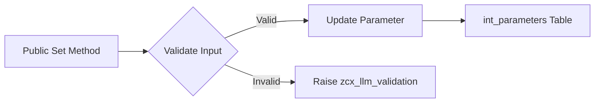

# Class ZCL_LLM_OPTIONS

AI Generated documentation.

## Overview  

The `zcl_llm_options` class implements configuration management for Large Language Model (LLM) parameters. It provides methods to set hyperparameters (e.g., temperature, top_p, seed) with validation, stores them as key-value pairs, and allows retrieval via `get_parameters()`.  

**Key Public Methods**:  

- **Setters**:  
  - Numerical parameters: `set_temperature`, `set_top_p`, `set_top_k`, `set_seed`, etc., with boundary validation (e.g., 0.0-2.0 for temperature).  
  - `set_custom_parameters`: Adds or updates arbitrary parameters.  
- **Validation**: All setters enforce valid ranges, raising `zcx_llm_validation` for invalid inputs.  
- **Data Management**: `get_parameters` returns the current configuration as a key-value table.  

## Dependencies  

- **Exceptions**: Relies on `zcx_llm_validation` for error handling.  
- **Data Structure**: Uses internal table type `zllm_keyvalues` for parameter storage.  

## Details  

**Key Implementation Aspects**:  

1. **Validation Logic**:  
   - `validate_range_float`/`validate_range_int` enforce min/max boundaries.  
   - Distinct error messages for out-of-range values (e.g., "Value 3.0 is above maximum 2.0").  

2. **Parameter Storage**:  
   - `int_parameters` table ensures unique keys via `DELETE` + `INSERT` in `set_parameter`.  
   - Values are stored as strings (e.g., `|{ temperature }|`), requiring parsing during retrieval.  

3. **Custom Parameters**:  
   - `set_custom_parameters` merges input parameters, overwriting existing keys.  
   - Supports extensibility for non-standard LLM parameters.  

**Test-Critical Behaviors** (from test summary):  

- Boundary checks (e.g., 0.0/2.0 for temperature).  
- Parameter overwrite integrity (last-set value persists).  
- Exception propagation for invalid inputs.
