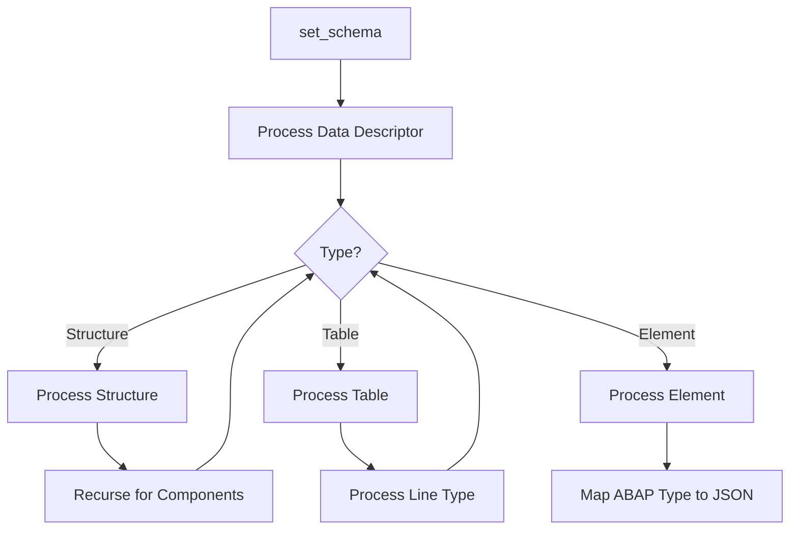

# Class ZCL_LLM_SO_JS

AI Generated documentation.

## Overview  

The class `ZCL_LLM_SO_JS` is a default implementation for generating JSON schemas from ABAP data structures. It implements the interface `ZIF_LLM_SO` to provide structured output definitions for LLM interactions.  

**Key Public Methods**:  

- `ZIF_LLM_SO~SET_SCHEMA`: Generates a JSON schema from an ABAP data descriptor. Validates and maps ABAP types (structures, tables, primitives) to JSON schema constructs.  
- `ZIF_LLM_SO~GET_SCHEMA`: Returns the generated schema as a JSON string.  
- `ZIF_LLM_SO~GET_DATATYPE`: Provides access to the ABAP data descriptor used for schema generation.  

Supports nested structures, tables, primitive types, enums, custom descriptions, and validation for unsupported types (e.g., `DATS`).  

## Dependencies  

- **ABAP Runtime Type Services (RTTS)**: Uses `CL_ABAP_*DESCR` classes for type introspection.  
- **Exceptions**: Raises `ZCX_LLM_VALIDATION` for unsupported types or invalid configurations.  
- **Interface**: Implements `ZIF_LLM_SO` for schema definition contracts.  

## Details  

### Schema Generation Flow  

**Key Logic**:  

1. **Type Handling**:  
   - **Structures**: Converted to JSON `object` types. Fields are recursively processed, and `required` properties are auto-generated.  
   - **Tables**: Mapped to JSON `array` types. Line types are processed to define `items`.  
   - **Primitives**: ABAP types (e.g., `INT`, `STRING`, `ABAP_BOOL`) are mapped to JSON equivalents. `CHAR1` fields are validated for boolean compliance.  

2. **Customization**:  
   - **Descriptions**: Injected via `descriptions` parameter in `SET_SCHEMA`. Supports nested paths (e.g., `field-subfield`).  
   - **Enums**: Defined via `enum_values` in descriptions, generating JSON `enum` constraints.  

3. **Validation**:  
   - Unsupported types (e.g., `DATS`, invalid `CHAR1`) trigger `ZCX_LLM_VALIDATION`.  
   - Schema syntax integrity is enforced (e.g., `additionalProperties: false`, strict ordering for multiple tables).  

### Field Context Tracking  

The `field_info` structure tracks nested paths (e.g., `root-field-subfield`) to align custom descriptions and enum values with the correct schema nodes. This enables:  

- Context-aware error messages.  
- Precise injection of metadata into deeply nested schemas.  

### Boolean Detection  

ABAP fields are mapped to JSON booleans only if:  

- Type is `CHAR1` (length 1).  
- Absolute name matches known boolean types (e.g., `ABAP_BOOL`).  
Other `CHAR1` fields raise `ZCX_LLM_VALIDATION` (tested in `test_char1_nonbool`).  

### Recursive Processing  

Methods like `PROCESS_STRUCTURE` and `PROCESS_TABLE` recursively resolve nested types, ensuring correct schema composition for complex hierarchies (e.g., tables of nested structures).
