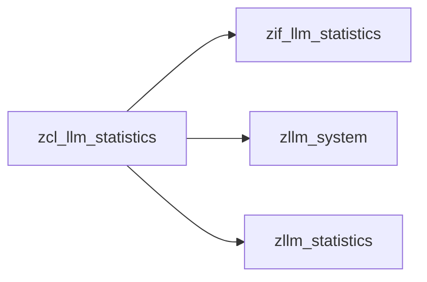
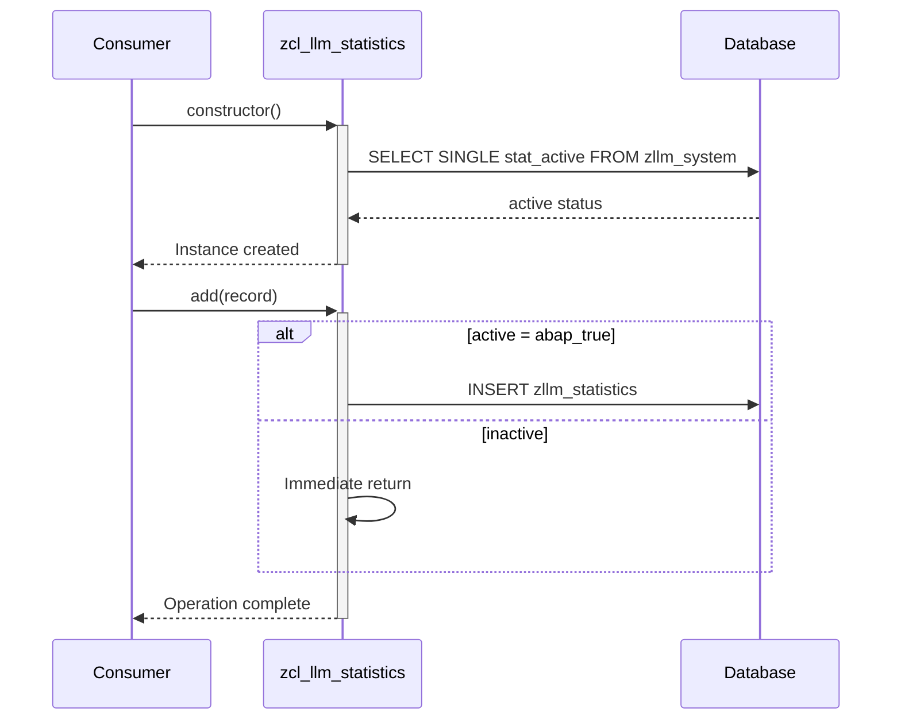

# Class ZCL_LLM_STATISTICS

AI Generated documentation.

## Overview

Provides conditional statistics recording functionality with activation control. Main public elements:

```abap
┌───────────────────────────┐
│ PUBLIC INTERFACE          │
├──────────────────────────┤
│ ➕ add(IMPORTING record)  │
│   (from zif_llm_statistics)│
│                           │
│ 🏗 constructor()          │
└──────────────────────────┘
```

Key characteristics:

- Activation state loaded once during instantiation
- Silent operation when inactive (no errors/exceptions)
- Direct database insertion when active

## Dependencies



Key dependencies:

- **zllm_system**: System configuration table (single record read)
- **zllm_statistics**: Statistics storage table (direct inserts)
- **zif_llm_statistics**: Mandatory interface implementation

## Details



Implementation notes:

1. **Activation Check**: Single database read during instantiation (performance optimized)
2. **Insert Logic**: Uses direct `INSERT` without commit (implies external transaction control)
3. **State Handling**: Protected attribute `active` allows extension in subclasses
4. **Error Handling**: Silent failure modes (no exception for inactive state or DB errors)
