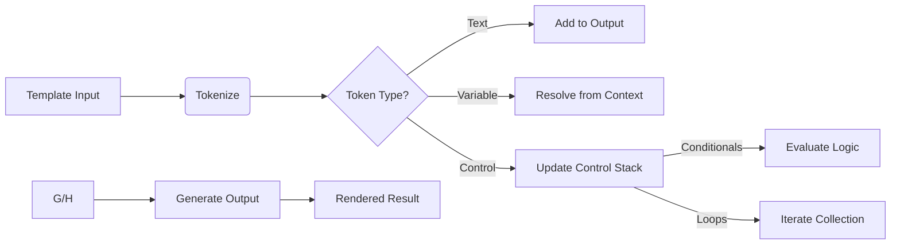

# Class ZCL_LLM_TEMPLATE_PARSER

AI Generated documentation.

## Overview  

The `ZCL_LLM_TEMPLATE_PARSER` class implements a template engine inspired by limited Jinja2 syntax, supporting variable substitution, control structures (conditionals, loops), filters, and error handling. Key functionalities include:  

- **Variable resolution** for flat/nested structures and tables.  
- **Control structures**: `if`/`elif`/`else`, `for` loops with metadata (e.g., `loop.last`).  
- **Filters** for string transformations (`upper`, `lower`, `default`).  
- **Error detection** for invalid paths, unclosed tokens, and type mismatches.  

### Public Methods  

| Method         | Purpose                                                                 |  
|----------------|-------------------------------------------------------------------------|  
| `ADD_TEMPLATE` | Registers templates with optional replacement; tokenizes content.      |  
| `RENDER`       | Generates output by parsing tokens against a data context.              |  

## Dependencies  

- Exception class `ZCX_LLM_TEMPLATE_PARSER` for error reporting.  
- ABAP Runtime Type Services (RTTS) for dynamic data structure resolution.  

## Details  

### Tokenization & Parsing Flow  



### Key Implementation Aspects  

1. **Tokenization**:  
   - Splits templates into `TEXT`, `VARIABLE`, `CONTROL`, and removes comments.  
   - Handles escape sequences (e.g., `\{`, `\}`) and multiline text.  

2. **Control Stack**:  
   - Manages nested `IF`/`FOR` structures with state tracking:  

     ```abap  
     TYPES: BEGIN OF control_stack_type,  
              type              TYPE string,  " 'IF' or 'FOR'  
              condition_met     TYPE abap_bool,  " For conditionals  
              loop_var          TYPE string,     " Loop variable name  
              collection        TYPE REF TO data," Iterated data  
              loop_tokens       TYPE tokens_type," Nested loop content  
            END OF control_stack_type.  
     ```  

3. **Variable Resolution**:  
   - Supports dot notation (`address.street`) and table indexing (`items[1]`).  
   - Applies filters (e.g., `{{ name | upper }}`) during resolution.  
   - Uses RTTS to dynamically navigate structures/tables.  

4. **Loop Processing**:  
   - Creates modified contexts for iterations, injecting:  
     - Loop variable (e.g., `item`).  
     - Metadata (`LOOP.index`, `LOOP.first`).  
   - Handles nested loops via token accumulation in `loop_tokens`.  

5. **Error Handling**:  
   - Detects unclosed control structures during final stack checks.  
   - Validates table indices and variable paths using RTTS.  

### Type Resolution Logic  

For structured data:  

1. Resolve initial context reference.  
2. Traverse path segments (e.g., `user.address.city`):  
   - For structures: Access component via `ASSIGN COMPONENT`.  
   - For tables: Validate index bounds (1-based).  
3. Format tables as comma-separated values or key-value pairs.  

### Performance Considerations  

- Tokenization occurs once per template (cached in `tokens` field).  
- Context cloning during loops may impact performance for large datasets.
