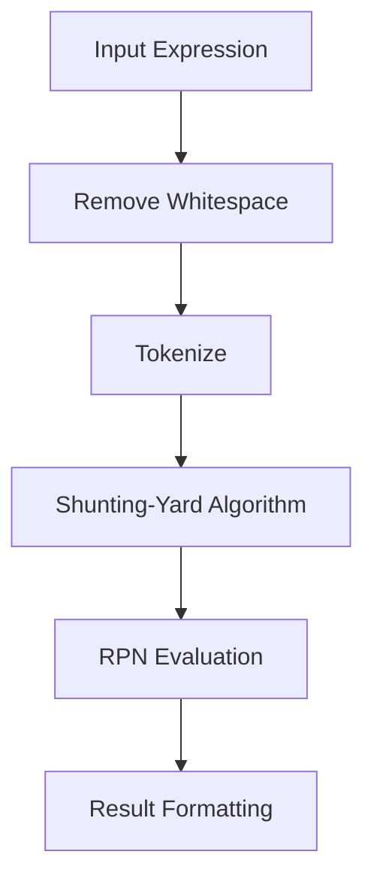

# Class ZCL_LLM_TOOL_CALCULATOR

AI Generated documentation.

## Overview  

The `ZCL_LLM_TOOL_CALCULATOR` class provides mathematical expression evaluation as a tool within an LLM framework. It implements the `ZIF_LLM_TOOL` interface for integration with tool management systems.  

**Key Public Methods**:  

1. **`ZIF_LLM_TOOL~GET_TOOL_DETAILS`**  
   - Returns metadata including:  
     - Tool name: `calculator`  
     - Description: Supports `+`, `-`, `*`, `/`, `**`, `MOD`, and parentheses  
     - Input parameter: `EXPRESSION` (string containing mathematical operations)  

2. **`ZIF_LLM_TOOL~EXECUTE`**  
   - Evaluates expressions using `EVALUATE_EXPRESSION`  
   - Handles errors:  
     - Division by zero  
     - Invalid characters/non-numeric inputs  
     - Syntax errors  

3. **`ZIF_LLM_TOOL~GET_RESULT`**  
   - Returns calculation results in standardized `CALCULATION_OUTPUT` format  

## Dependencies  

- Interface: `ZIF_LLM_TOOL` for tool integration  
- Exceptions: `CX_SY_ZERODIVIDE`, `CX_SY_ARITHMETIC_ERROR`, `CX_SY_CONVERSION_NO_NUMBER`  

## Details  

### Expression Processing Flow  



**Key Components**:  

1. **Tokenization**  
   - Identifies numbers (including negatives/decimals) and operators (`+`, `-`, `*`, `/`, `**`, `MOD`, parentheses)  
   - Example: `"5+3*2"` becomes `[5, +, 3, *, 2]`  

2. **Operator Precedence**  

   ```mermaid  
   graph LR  
     A[**] -->|Highest| B[*, /, MOD]  
     B --> C[+, -]  
     C -->|Lowest| D[()]  
   ```  

3. **Shunting-Yard Algorithm**  
   - Converts infix notation to Reverse Polish Notation (RPN)  
   - Handles nested parentheses and operator precedence  

4. **RPN Evaluation**  
   - Uses stack-based computation with error checks:  
     - Division/modulo by zero  
     - Invalid operator sequences  
     - Exponent edge cases (e.g., `0^-2`)  

**Special Handling**:  

- Negative numbers detection in tokenizer  
- Scientific notation support via `DECFLOAT34` type  
- Localized number formatting in output using `NUMBER = USER`  

**Error Reporting**:  

- Returns structured messages for:  
  - `Error: Division by zero`  
  - `Error: Invalid expression: [details]`  
  - Implicit conversion failures via ABAP exceptions  

**Test Coverage Alignment**:  

- Implements all verified test cases including bracket nesting, operator precedence, and edge cases from the test summary  
- Uses ABAP exceptions for error propagation to match test validation requirements
