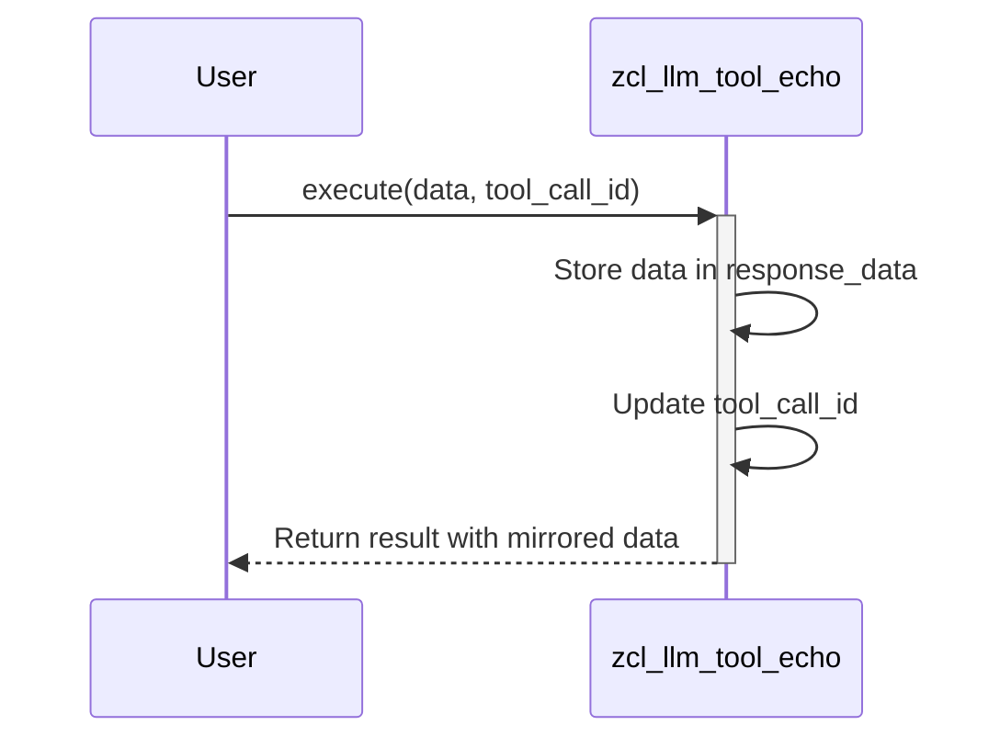

# Class ZCL_LLM_TOOL_ECHO

AI Generated documentation.

## Overview  

The `zcl_llm_tool_echo` class implements a simple echo tool that mirrors input data. It adheres to the `zif_llm_tool` interface, providing standardized access to tool metadata and execution results.  

**Key Public Methods**:  

- **`constructor`**: Initializes the tool with metadata (`tool_details`).  
- **`execute`**: Stores input `data` and `tool_call_id`, returning them as part of the result.  
- **`get_tool_details`**: Returns metadata (e.g., name, purpose) configured during initialization.  
- **`get_result`**: Provides access to the stored response data and execution context.  

## Dependencies  

- Implements interface **`zif_llm_tool`** (mandatory methods and type definitions).  
- Relies on the structure **`zif_llm_tool=>tool_details`** for metadata management.  

## Details  

### Data Flow  

### Key Implementation Notes  

1. **Generic Data Handling**:  
   - Uses `TYPE REF TO data` for `response_data` to support arbitrary input structures.  
   - No data transformation occurs – input is stored and returned as-is.  

2. **Execution Context**:  
   - The `tool_call_id` links execution requests to results (critical for asynchronous operations or audit trails).  

3. **Metadata Propagation**:  
   - The `tool_details` (provided during construction) are reused in `get_result` and `get_tool_details`, ensuring consistency.  

4. **Stateless Design**:  
   - Each `execute` call overwrites previous `response_data` and `tool_call_id`, making the instance unsuitable for concurrent use.
