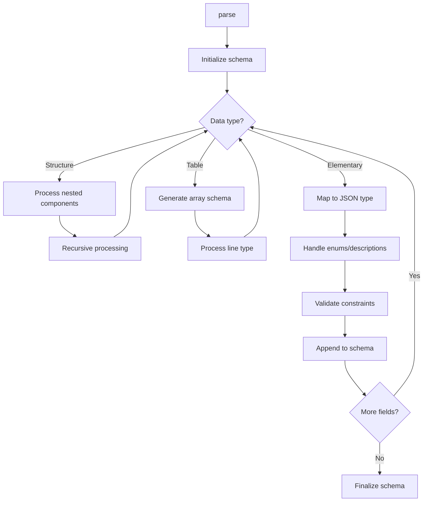

# Class ZCL_LLM_TOOL_PARSER

AI Generated documentation.

## Overview  

The class `ZCL_LLM_TOOL_PARSER` generates JSON schemas from ABAP data structures, enabling structured data validation and tooling integration. It focuses on mapping ABAP types (elementary types, structures, tables) to JSON schema constructs while incorporating metadata like field descriptions and enum values.  

**Public Methods**:  

- `zif_llm_tool_parser~parse`:  
  Main entry point. Converts an ABAP data structure into a JSON schema string. Handles nested structures, tables, type validation, and metadata integration.  

## Dependencies  

- **Exceptions**: `zcx_llm_validation` for error reporting.  
- **Type Descriptors**: Relies on `cl_abap_typedescr`, `cl_abap_structdescr`, `cl_abap_tabledescr`, and `cl_abap_elemdescr` for ABAP type introspection.  

## Details  

### Schema Generation Flow  

### Key Implementation Aspects  

1. **Type Mapping**:  
   - ABAP `INT`/`INT8` → JSON `integer`  
   - ABAP `DECFLOAT` → JSON `number`  
   - ABAP `STRING` → JSON `string`  
   - ABAP `CHAR1` with boolean context → JSON `boolean` (validated via type pool checks).  

2. **Metadata Integration**:  
   - Field descriptions from `descriptions` are injected into the schema.  
   - Enum values are converted to JSON `enum` arrays.  

3. **Nested Structures**:  
   - Nested ABAP structures become JSON `object` types with `properties`.  
   - Paths (e.g., `field-subfield`) are tracked for metadata assignment.  

4. **Table Handling**:  
   - ABAP tables are mapped to JSON `array` types.  
   - Supports tables of structures (nested objects) and multi-level nesting.  

5. **Validation**:  
   - Rejects unsupported types (e.g., type `D`).  
   - Ensures `CHAR1` fields not flagged as booleans throw errors.  
   - Enforces required fields in generated schemas.  

6. **Extension Hooks**:  
   - Empty `pre_*`/`post_*` methods (e.g., `pre_object`, `post_array`) allow subclassing for custom logic.  

### Example Interaction  

When processing a table field:  

1. `process_table` generates an `array` skeleton.  
2. `process_type` resolves the line type (e.g., a structure).  
3. `process_structure` recursively adds properties for each component.  
4. Metadata (descriptions, enums) is injected during field processing.  

This ensures complex ABAP data models are accurately represented as JSON schemas for downstream tooling.
