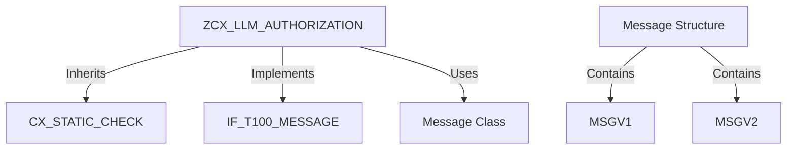

# Class ZCX_LLM_AUTHORIZATION

AI Generated documentation.

## Overview

Custom exception class for authorization-related errors in LLM client operations. Designed to handle T100 message propagation with specific error contexts.

**Key Elements**:

- Inherits from `CX_STATIC_CHECK` for exception handling
- Implements standard SAP message interfaces `IF_T100_DYN_MSG` and `IF_T100_MESSAGE`
- Contains 4 predefined message constants for common authorization scenarios:
  - Provider maintenance errors (PROVIDER_MAINTENANCE)
  - Client retrieval failures (GET_CLIENT)
  - Encryption/decryption issues (ENCRYPT/DECRYPT)

**Public Methods**:

```abap
CONSTRUCTOR
  IMPORTING
    !TEXTID      LIKE IF_T100_MESSAGE=>T100KEY  " Message identifier
    !PREVIOUS    LIKE PREVIOUS                  " Previous exception
```

## Dependencies

- Parent class: `CX_STATIC_CHECK`
- Message interfaces: `IF_T100_DYN_MSG`, `IF_T100_MESSAGE`
- Message class: `ZLLM_CLIENT` (contains actual message texts)

## Details

**Message Structure**:



**Key Implementation Details**:

1. **Message Constants**:
   - Each constant group defines message ID/number pairs from `ZLLM_CLIENT`
   - `GET_CLIENT` supports 1 message variable (`MSGV1`), others use static texts

2. **Constructor Logic**:

```abap
IF textid IS INITIAL
  Use default message ID
ELSE
  Use provided message identifier
ENDIF
```

Handles both predefined messages (via constants) and custom messages through TEXTID parameter. Propagates previous exceptions via `PREVIOUS` parameter.
