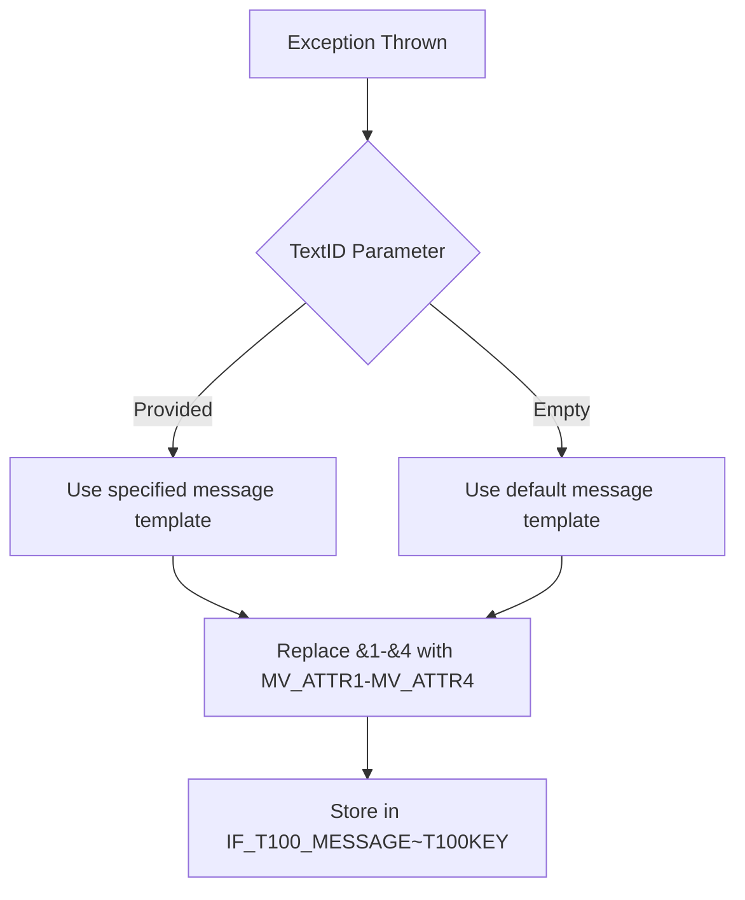

# Class ZCX_LLM_HTTP_ERROR

AI Generated documentation.

## Overview

Custom exception class for HTTP error handling in SAP systems, inheriting from `CX_STATIC_CHECK`. Designed for structured error reporting in HTTP client operations.

**Key components**:

- Implements `IF_T100_MESSAGE` for message handling
- 4 predefined error types with message placeholders:
  - HTTP client initialization errors
  - Communication failures
  - HTTP processing errors
  - Generic HTTP exceptions
- Public attributes `MV_ATTR1`-`MV_ATTR4` for dynamic error context

**Main method**:

```abap
CONSTRUCTOR(
  IMPORTING
    !TEXTID        LIKE if_t100_message=>t100key  " Error type selector
    !ATTR1-ATTR4   TYPE STRING                     " Context variables
    !PREVIOUS      LIKE previous                   " Exception chaining
)
```

## Dependencies

- Inherits from standard exception class `CX_STATIC_CHECK`
- Implements interface `IF_T100_MESSAGE` (SAP message protocol)

## Details

### Message Structure



**Attribute mapping**:

| Message Placeholder | Class Attribute |
|---------------------|-----------------|
| &1                  | MV_ATTR1        |
| &2                  | MV_ATTR2        |
| &3                  | MV_ATTR3        |
| &4                  | MV_ATTR4        |

**Key implementation notes**:

1. Message variants defined as constants with:
   - Fixed message ID `ZLLM_CLIENT`
   - Unique message numbers (006-009)
   - Attribute mapping configuration
2. Constructor enables exception chaining through `PREVIOUS` parameter
3. Final class design prevents subclass specialization
4. Supports up to 4 dynamic context variables for message personalization
5. Error hierarchy: `CX_STATIC_CHECK` → `ZCX_LLM_HTTP_ERROR`
