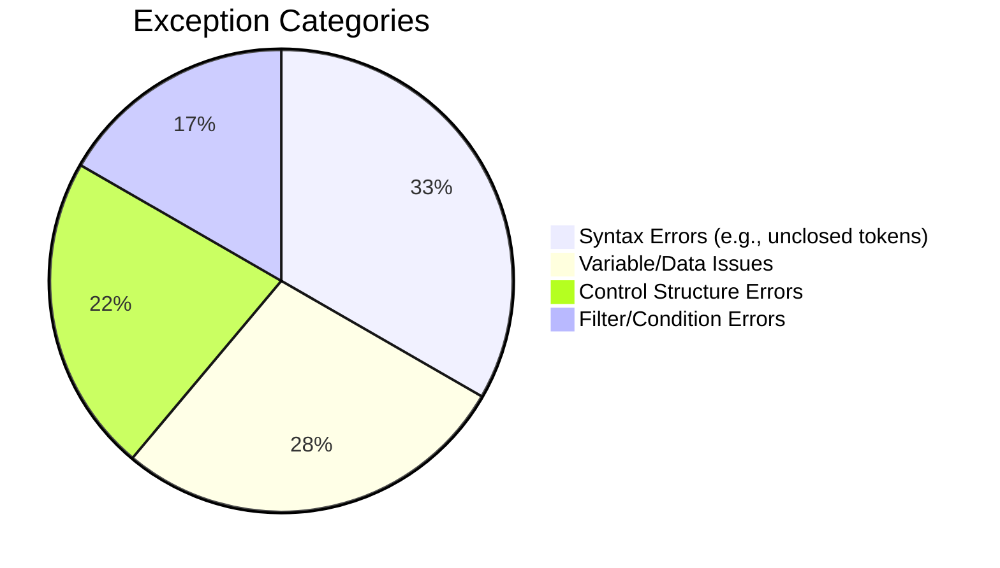
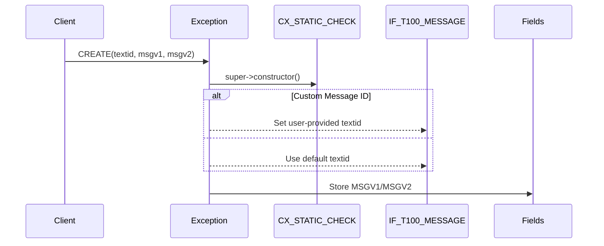

# Class ZCX_LLM_TEMPLATE_PARSER

AI Generated documentation.

## Overview  

`ZCX_LLM_TEMPLATE_PARSER` is a custom exception class for handling errors in template parsing logic. It inherits from `CX_STATIC_CHECK` and implements SAP standard message interfaces (`IF_T100_DYN_MSG`, `IF_T100_MESSAGE`) to support dynamic message handling.  

**Key Functionality**:  

- Raises structured exceptions for template parsing failures (e.g., unclosed tokens, invalid syntax, variable resolution errors).  
- Supports message variable substitution (`MSGV1`, `MSGV2`) for dynamic error details.  

**Public Methods**:  

- `CONSTRUCTOR`: Initializes the exception with message IDs, variables, and optional previous exception.  

**Main Error Types**:  



## Dependencies  

- Inherits from SAP standard exception class `CX_STATIC_CHECK`.  
- Uses message IDs from message class `ZLLM_CLIENT` (messages 022-042).  

## Details  

### Message Handling Structure  

Each error constant defines:  

- `MSGID`: Message class (`ZLLM_CLIENT`)  
- `MSGNO`: Unique message number  
- Attributes (`ATTR1`-`ATTR4`): Map to `MSGV1`-`MSGV4` for variable substitution  

**Example**:  

```abap  
constants:  
  BEGIN OF invalid_variable_path,  
    msgid TYPE symsgid VALUE 'ZLLM_CLIENT',  
    msgno TYPE symsgno VALUE '025',  
    attr1 TYPE scx_attrname VALUE 'MSGV1',  " Stores invalid path  
  END OF invalid_variable_path.  
```  

### Constructor Logic  



**Key Implementation Notes**:  

- Supports exception chaining via `PREVIOUS` parameter.  
- Message variables (`MSGV1`-`MSGV4`) are optional but required for errors using attributes (e.g., `invalid_variable_path` expects `MSGV1`).  
- Errors like `MISMATCHED_TOKEN` use two variables (`MSGV1`, `MSGV2`) for detailed diagnostics.
