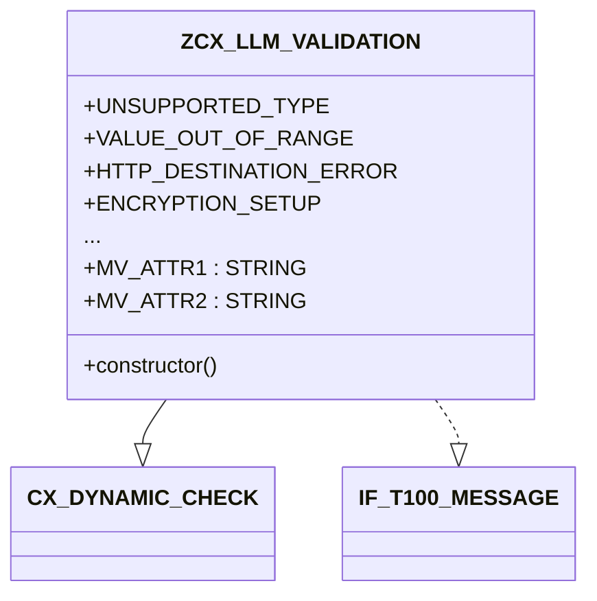

# Class ZCX_LLM_VALIDATION

AI Generated documentation.

## Overview  

`ZCX_LLM_VALIDATION` is a custom exception class for validation and technical errors in SAP systems, specializing in Large Language Model (LLM) client operations. Inherits from `CX_DYNAMIC_CHECK` for runtime checks and implements `IF_T100_MESSAGE` for standardized message handling.

**Key Public Components**:  

- **Exception Constants**: Predefined error types (e.g., `MODEL_DOES_NOT_EXIST`, `ENCRYPTION_FAILED`) with message IDs (`ZLLM_CLIENT`) and attribute mappings.  
- **Attributes**: `MV_ATTR1`-`MV_ATTR4` to store dynamic error details (e.g., model names, provider IDs).  
- **Constructor**: Initializes exception with message ID, attributes, and optional previous exception.  

## Dependencies  

- Inherits from `CX_DYNAMIC_CHECK` (SAP standard exception class).  
- Implements interface `IF_T100_MESSAGE` for message integration.  

## Details  

### Exception Structure  



**Key Aspects**:  

1. **Message Constants**:  
   - Each constant defines:  
     - `msgid`: Message class `ZLLM_CLIENT`  
     - `msgno`: Unique message number (e.g., `002` for `MODEL_DOES_NOT_EXIST`)  
     - Attribute bindings (up to 4 placeholders).  

   Example:  

   ```abap  
   constants:  
     begin of CLIENT_MODEL_NOT_FOUND,  
       msgid type symsgid value 'ZLLM_CLIENT',  
       msgno type symsgno value '005',  
       attr1 type scx_attrname value 'MV_ATTR1',  // Populated via MV_ATTR1  
       attr2 type scx_attrname value 'MV_ATTR2',  // Populated via MV_ATTR2  
     end of CLIENT_MODEL_NOT_FOUND.  
   ```  

2. **Attribute Handling**:  
   - Attributes (`MV_ATTR1`-`MV_ATTR4`) inject runtime values into exception messages (e.g., invalid model name).  
   - Used in error messages via `&MV_ATTR1&` placeholders in message texts.  

3. **Constructor Logic**:  
   - Propagates attributes to superclass.  
   - Sets `T100KEY` for message resolution:  
     - Uses `default_textid` if no `TEXTID` is provided.  
     - Enables exception chaining via `PREVIOUS` parameter.  

**Typical Usage**:  

```abap  
RAISE EXCEPTION TYPE zcx_llm_validation  
  EXPORTING  
    textid = zcx_llm_validation=>model_does_not_exist  
    attr1  = 'MODEL_X'.  
```  

Throws an exception with message "Model MODEL_X does not exist" (assuming message 002 in `ZLLM_CLIENT` uses `&MV_ATTR1&`).
