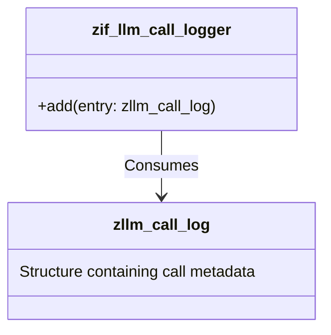

# Interface ZIF_LLM_CALL_LOGGER

AI Generated documentation.

## Overview  

Provides standardized logging functionality for system calls through a single-method interface.  

**Public Methods**:  

```abap
METHODS add
  IMPORTING
    entry TYPE zllm_call_log.
```  

- **`add`**: Stores log entries  
  Accepts a structured log entry parameter (`zllm_call_log`) containing call metadata, errors, or processing details.  

## Dependencies  



**Key Dependency**:  

- **`zllm_call_log`**: Data structure defining log entry format (fields typically include timestamps, call parameters, status codes, error messages)
