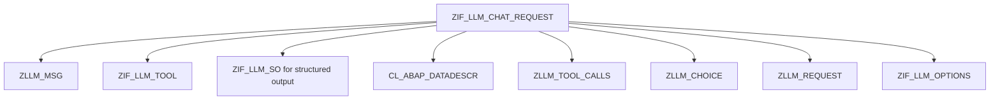

# Interface ZIF_LLM_CHAT_REQUEST

AI Generated documentation.

## Overview  

Interface `ZIF_LLM_CHAT_REQUEST` provides methods for managing chat requests with LLM (Large Language Model) integration, including message handling, tool configuration, and structured output control.

**Core Functionality:**  

1. **Message Management**  
   - `ADD_MESSAGE`/`ADD_MESSAGES`: Append single/multiple messages (`ZLLM_MSG`/`ZLLM_MSGS`)  
   - `GET_MESSAGES`: Retrieve all messages  
   - `CLEAR_MESSAGES`: Reset message list  

2. **Tool Integration**  
   - `ADD_TOOL`/`ADD_TOOLS`: Register tools (`ZIF_LLM_TOOL` instances) with tool choice strategy  
   - `SET_TOOL_CHOICE`: Control tool selection behavior (`none|auto|required|<tool_name>`)  
   - `GET_TOOLS`/`CLEAR_TOOLS`: Manage tool registry  

3. **Structured Output**  
   - `SET_STRUCTURED_OUTPUT`: Define output schema using data descriptions (`CL_ABAP_DATADESCR`)  
   - `SET_STRUCTURED_OUTPUT_ACTIVE`: Toggle structured output feature  

4. **Internal Handling**  
   - `ADD_TOOL_RESULT`/`ADD_TOOL_CHOICES`: Process tool execution feedback  
   - `GET_INTERNAL_REQUEST`: Access low-level request object (`ZLLM_REQUEST`)  
   - `OPTIONS`: Configure runtime parameters via `ZIF_LLM_OPTIONS`  

## Dependencies  

**Key Components:**  

**Type References:**  

- `ZLLM_MSG`/`ZLLM_MSGS`: Message data structures  
- `ZLLM_TOOLS`: Table type for tool instances  
- `ZLLM_TOOL_CALLS`: Tool execution tracking  
- `ZLLM_REQUEST`: Internal request container
