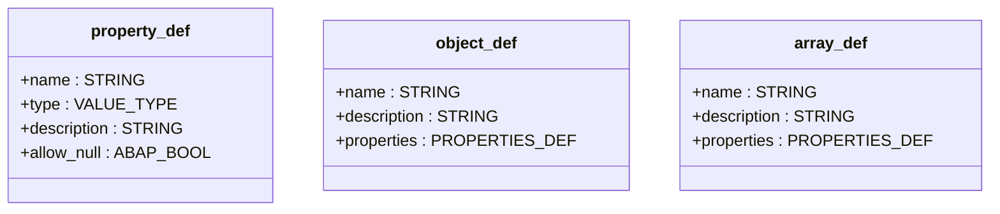

# Interface ZIF_LLM_CLIENT_JSON_SCHEMA

AI Generated documentation.

## Overview  

Interface `ZIF_LLM_CLIENT_JSON_SCHEMA` provides methods to define and generate JSON schemas with structured data types.  

**Key Methods**:  

- `NEW_FORMAT`  
  - **Purpose**: Factory method to create a new schema instance.  
  - **Parameters**:  
    - `title`: Schema title (root JSON object name).  

- `ADD_PROPERTY`  
  - **Purpose**: Adds a primitive property (string, number, boolean, integer).  
  - **Parameters**:  
    - `property`: Property definition with name, type, description, and nullability.  
  - **Exception**: `ZCX_LLM_VALIDATION` for invalid inputs.  

- `ADD_ARRAY`  
  - **Purpose**: Defines an array containing objects with specified properties.  
  - **Parameters**:  
    - `array`: Array definition with name, description, and nested properties.  
  - **Limitation**: Supports single-level nesting.  

- `ADD_OBJECT`  
  - **Purpose**: Adds a nested object structure.  
  - **Parameters**:  
    - `object`: Object definition with name, description, and properties.  

- `GENERATE_SCHEMA`  
  - **Purpose**: Outputs the final JSON schema as a string.  

## Dependencies  

- Exception class `ZCX_LLM_VALIDATION` for validation errors.  
- Self-referential return type in `NEW_FORMAT` (factory pattern).  

---

**Key Data Types**:  

*Supports primitive types, objects, and arrays (single-level nesting only).*
