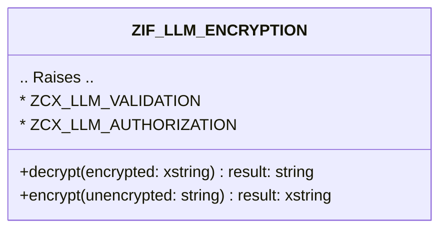

# Interface ZIF_LLM_ENCRYPTION

AI Generated documentation.

## Overview  

Interface `ZIF_LLM_ENCRYPTION` provides methods for secure encryption and decryption of sensitive data. Designed for handling secrets, it supports conversion between human-readable strings and encrypted byte data.  

### Public Methods  

| **Method** | **Description** | **Input** | **Output** | **Exceptions** |  
|------------|-----------------|-----------|------------|----------------|  
| `DECRYPT` | Converts encrypted byte data (`xstring`) back to a readable string. | `encrypted` (encrypted byte data) | `result` (decrypted string) | `ZCX_LLM_VALIDATION` (invalid input/process), `ZCX_LLM_AUTHORIZATION` (access denied) |  
| `ENCRYPT` | Encrypts a plaintext string into secure byte data. | `unencrypted` (plaintext string) | `result` (encrypted byte data) | Same as `DECRYPT` |  

## Dependencies  

- **Exceptions**: Relies on custom exceptions [`ZCX_LLM_VALIDATION`](#) and [`ZCX_LLM_AUTHORIZATION`](#) for error handling.  
- **Data Types**: Uses `xstring` (byte string) and `string` for input/output conversions.  

