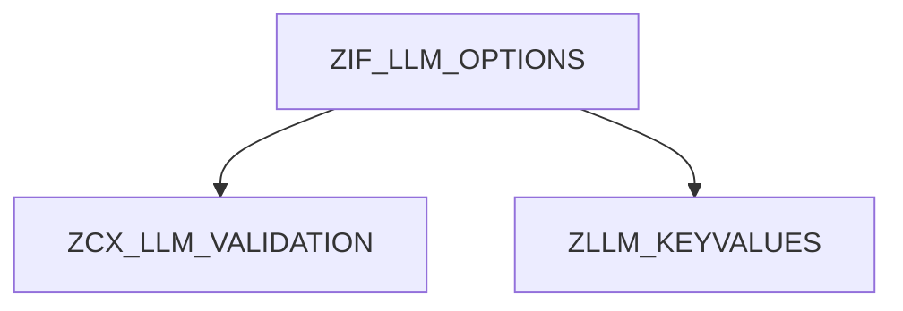

# Interface ZIF_LLM_OPTIONS

AI Generated documentation.

```markdown
## Overview
Interface `ZIF_LLM_OPTIONS` configures parameters for Large Language Model (LLM) API calls. Provides validation-enabled setters for generation parameters and access to custom parameters.

**Key Methods**:
- `SET_TEMPERATURE`: Controls randomness (`DECFLOAT16` [0-2])
- `SET_MAX_TOKENS`: Limits response length (`INTEGER > 0`)  
- `SET_TOP_P`: Nucleus sampling threshold (`DECFLOAT16` [0-1])
- `SET_TOP_K`: Top-k token filtering (`INTEGER ≥1`)
- `SET_SEED`: Ensures reproducible outputs (`INTEGER`)
- `SET_FREQUENCY_PENALTY`: Reduces repetition (`DECFLOAT16` [-2-2])
- `SET_PRESENCE_PENALTY`: Encourages new topics (`DECFLOAT16` [-2-2])
- `SET_MIN_P`: Minimum probability threshold (`DECFLOAT16` [0-1])
- `SET_TOP_A`: Alternative sampling method (`DECFLOAT16` [0-1])
- `SET_CUSTOM_PARAMETERS`: Key-value store for model-specific parameters
- `GET_PARAMTERS`: Retrieves all configured parameters

All setters raise `ZCX_LLM_VALIDATION` for invalid inputs except `SET_CUSTOM_PARAMETERS`.

## Dependencies


**Key Dependencies**:

1. `ZCX_LLM_VALIDATION`: Validation exception class
2. `ZLLM_KEYVALUES`: Typed dictionary structure for custom parameters

```

