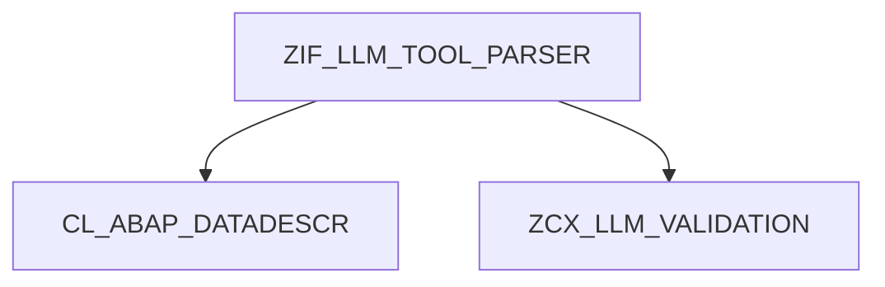

# Interface ZIF_LLM_TOOL_PARSER

AI Generated documentation.

## Overview

Interface `ZIF_LLM_TOOL_PARSER` provides standardized parsing of tool definitions using ABAP data descriptors and metadata.

### Public Methods

```abap
METHODS parse
  IMPORTING
    data_desc     TYPE REF TO cl_abap_datadescr
    descriptions  TYPE def_descriptions OPTIONAL
  RETURNING VALUE(result) TYPE string
  RAISING zcx_llm_validation.
```

Key characteristics:

- Processes data structures via `data_desc` parameter (ABAP Data Description reference)
- Accepts optional field metadata (`descriptions`) for enhanced parsing context
- Returns parsed output as string
- Throws `ZCX_LLM_VALIDATION` for parsing/validation errors

## Dependencies



Main dependencies:

1. `CL_ABAP_DATADESCR` (ABAP Runtime) - Provides data structure metadata for parsing
2. `ZCX_LLM_VALIDATION` (Custom Exception) - Error handling for validation failures
