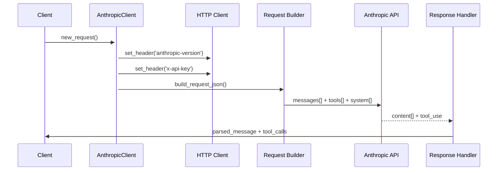

# Class ZCL_LLM_CLIENT_ANTHROPIC

AI Generated documentation.

## Overview  

Provides client implementation for interacting with Anthropic's LLM API. Inherits from base LLM client (`ZCL_LLM_CLIENT_BASE`) and implements Anthropic-specific API handling.

**Key Public Methods**:  

1. `GET_CLIENT`: Factory method returning client instance  
2. `CONSTRUCTOR`: Initializes client with configs  
3. `ZIF_LLM_CLIENT~NEW_REQUEST`: Creates request with Anthropic-specific defaults (e.g., 8192 max tokens)  

**Main Features**:  

- Handles Anthropic API authentication (x-api-key)  
- Implements message formatting per Anthropic requirements  
- Processes responses with Anthropic-specific content structures  
- Supports tool definitions and tool choice handling  

## Dependencies  

1. `ZCL_LLM_HTTP_CLIENT_WRAPPER`: HTTP communication  
2. `ZCL_LLM_COMMON`: Utility methods and BAdI access  
3. Encryption class via BAdI `GET_ENCRYPTION_IMPL`  
4. Exceptions: `ZCX_LLM_VALIDATION`, `ZCX_LLM_AUTHORIZATION`  

## Details  

### Key Implementation Flow  



### Implementation Highlights  

1. **HTTP Client Configuration**  
   - Sets required `anthropic-version: 2023-06-01` header  
   - Uses encrypted API key from provider config  

2. **Message Processing**  
   - Separates system messages into dedicated JSON array  
   - Handles tool call responses with `type: tool_use`  
   - Converts tool results to Anthropic's `tool_result` format  

3. **Tool Handling**  

   ```mermaid
   classDiagram
       class Tool_Definition{
           +name
           +description
           +input_schema
       }
       class Tool_Choice{
           +type: auto|any|tool
           +name
       }
       AnthropicRequest --* Tool_Definition
       AnthropicRequest --* Tool_Choice
   ```

   - Requires tool definitions when tools are used  
   - Supports three tool choice modes: auto, any, specific tool  

4. **Response Parsing**  
   - Processes nested `content[]` array with text/tool_use entries  
   - Converts Anthropic's `input` structure to standard tool call format  
   - Handles token usage statistics  

5. **Limitations**  
   - Structured output not supported (explicitly ignored)  
   - Maximum tokens hardcoded to 8192  
   - Requires manual system message separation
