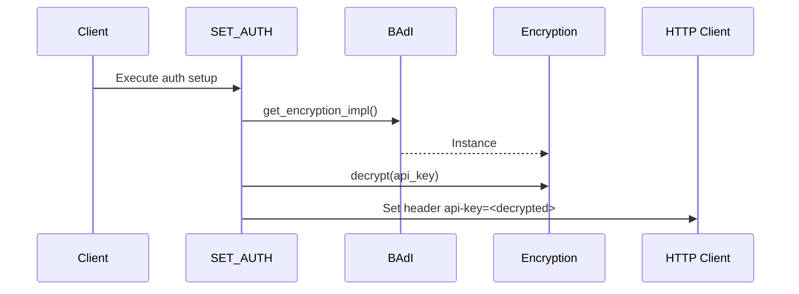

# Class ZCL_LLM_CLIENT_AZUREOAI

AI Generated documentation.

## Overview  

Provides Azure OpenAI client implementation for SAP ABAP systems, handling API communication and authentication. Inherits from base client class `ZCL_LLM_CLIENT_BASE`.

**Key Public Methods**:  

1. `GET_CLIENT`  
   - Factory method creating client instances  
   - Validates configurations via parent constructor  
   - Raises `ZCX_LLM_VALIDATION`/`ZCX_LLM_AUTHORIZATION` for configuration errors  

2. `CONSTRUCTOR`  
   - Initializes client with provider-specific settings  
   - Inherits validation logic from parent class  

**Core Capabilities**:  

- Secure API key handling with encryption support  
- Dynamic endpoint construction  
- JSON structured response generation  

## Dependencies  

1. `ZCL_LLM_HTTP_CLIENT_WRAPPER` - HTTP client management  
2. `ZCL_LLM_SO_JS_AZUREOAI` - Azure-specific JSON response handler  
3. `ZCL_LLM_COMMON` - BAdI access for encryption implementations  
4. Custom encryption class via BAdI `GET_ENCRYPTION_IMPL`  

## Details  

### Authentication Flow  



**Key Implementation Notes**:  

1. **Endpoint Construction**:  

   ```abap
   |/{model}/chat/completions?api-version={api_version}|
   ```  

   Uses constant `API_VERSION` (2024-10-21) for versioning  

2. **Encrypted Credentials**:  
   - Decrypts `AUTH_ENCRYPTED` via BAdI-implemented encryption class  
   - Supports clear-text fallback if encryption not used  

3. **Structured Output**:  
   Instantiates Azure-specific JSON parser `ZCL_LLM_SO_JS_AZUREOAI`  

4. **HTTP Client Management**:  
   Delegates to wrapper class for:  
   - Connection pooling  
   - SSL configuration  
   - Proxy handling  

**Exception Strategy**:  

- Parent class handles common validation errors  
- Custom authorization errors when:  
  - Encrypted API key decryption fails  
  - Invalid authentication type configuration
