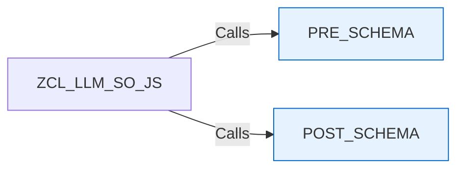

# Class ZCL_LLM_SO_JS_AZUREOAI

AI Generated documentation.

## Overview  

Provides specialized JSON schema construction for Azure OpenAI integration within SAP systems. Inherits core JSON schema generation capabilities from parent class `ZCL_LLM_SO_JS`.  

**Key Aspects**:  

- Overrides protected template methods `PRE_SCHEMA` and `POST_SCHEMA` to enforce Azure-specific schema structure.  
- Public interface inherited from parent (no new public methods added).  

## Dependencies  

- Inherits from `ZCL_LLM_SO_JS` (base JSON schema generator).  

## Details  

### Method Implementation  



**Core Logic**:  

1. `PRE_SCHEMA`:  
   - Injects Azure OpenAI root schema header:  

     ```json  
     "name":"Response","strict":true,"schema":{  
     ```  

   - Enforces strict validation and response structure  

2. `POST_SCHEMA`:  
   - Closes the root schema with `}`  
   - Ensures valid JSON structure completion  

**Design Pattern**:  

- Implements **Template Method Pattern** via inherited `PROCESS_SCHEMA` (parent control flow with specialized steps).  

**Critical Implementation Notes**:  

- Schema construction order is parent-managed  
- Strict mode activation is Azure-specific requirement  
- Class is marked `FINAL` to prevent unintended extension
