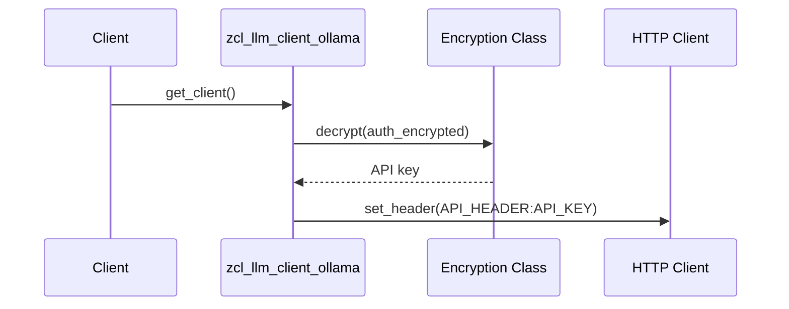
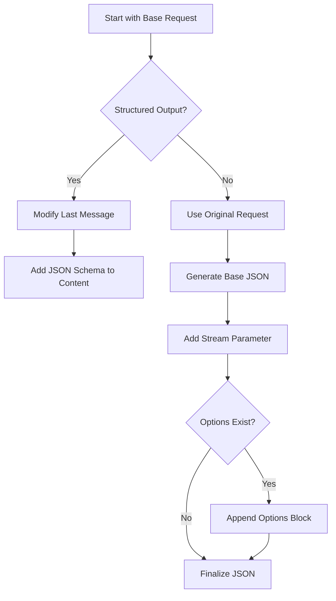

# Class ZCL_LLM_CLIENT_OLLAMA

AI Generated documentation.

## Overview

Implements Ollama LLM client functionality by extending base LLM client (`zcl_llm_client_base`). Key features:

- **Public Methods**:
  - `get_client`: Factory method creating preconfigured client instances
  - `constructor`: Initializes client with configs and performs auth setup

- **Core Capabilities**:
  - Handles Ollama-specific API communication
  - Supports structured JSON output generation
  - Implements tool call functionality for LLM responses
  - Manages authentication with optional API keys
  - Processes Ollama-specific response formats

## Dependencies

- **`zcl_llm_http_client_wrapper`**: HTTP client management
- **`zcl_llm_common`**: JSON serialization/deserialization utilities
- **`zcx_llm_validation`/`zcx_llm_authorization`**: Exception classes
- **BAdI `ZLLM_BADI`**: Encryption implementation for credentials
- **`/ui2/cl_json`**: JSON handling for tool call arguments

## Details

### Authentication Flow



### Request Building Logic

Key aspects of `build_request_json`:

1. Modifies last message for structured output by appending JSON schema
2. Adds Ollama-specific parameters:
   - `stream: false` for non-streaming responses
   - `format` parameter when using structured output
   - Custom `options` from request parameters



### Response Handling

`handle_http_response` implements:

- Error mapping for HTTP status codes
- Tool call processing with argument deserialization
- Token usage statistics from Ollama-specific fields
- Structured output parsing when enabled

**Tool Call Processing**:

```abap
LOOP AT response-message-tool_calls
  IF tool matches registered tools
    CREATE DATA func_result TYPE HANDLE parameters
    DESERIALIZE arguments to func_result
    ADD TO result-choice-tool_calls
  ELSE IF required tool missing
    SET ERROR
```

### Type Mappings

Custom Ollama types ensure proper API communication:

- `ollama_response`: Matches Ollama's chat response format
- `ollama_tool_call`: Handles nested tool call structure
- `ollama_message`: Extends standard messages with tool calls table

### Structured Output Handling

Special treatment in both request building and response parsing:

1. Modifies prompt to include JSON schema
2. Adds `format` parameter to request
3. Uses dedicated parser for JSON responses
4. Handles potential parsing errors with specific error messages
