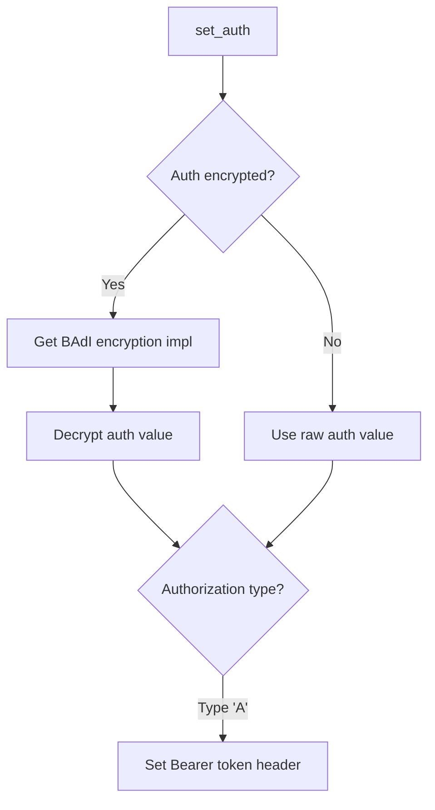

# Class ZCL_LLM_CLIENT_OPENAI

AI Generated documentation.

## Overview  

**zcl_llm_client_openai** is a specialized SAP ABAP client implementation for interacting with OpenAI services. It inherits from the base LLM client class (`zcl_llm_client_base`) and implements provider-specific logic.  

Key public methods:  

- **`get_client`**: Factory method to create an instance using configurations (`zllm_clnt_config`, `zllm_providers`).  
- **`constructor`**: Initializes the client with configurations and performs setup (raises validation/authorization errors).  

Core capabilities:  

- Handles OpenAI-specific endpoint paths (e.g., `/chat/completions`).  
- Manages authentication (supports encrypted API keys via BAdI).  
- Creates structured output handlers for JSON/OpenAPI formats.  

## Dependencies  

- **`zcl_llm_http_client_wrapper`**: HTTP client management.  
- **`zcl_llm_common`**: Retrieves BAdI implementations (e.g., encryption).  
- **`zcl_llm_so_js_oa`**: Structured JSON/OpenAPI output handler.  
- BAdI implementations for encryption/decryption.  

## Details  

### Authentication Flow  

- Decrypts API keys using BAdI-based encryption if configured.  
- Supports Bearer token authentication.  

### HTTP Client Initialization  

Uses `zcl_llm_http_client_wrapper` to abstract HTTP client creation, ensuring consistent configuration handling across providers.  

### Structured Output Handling  

Instantiates `zcl_llm_so_js_oa` to process JSON/OpenAPI responses, enabling standardized output parsing.  

### Critical Implementation Notes  

1. **Encryption BAdI**: Requires a BAdI implementation (`get_encryption_impl`) for secure API key decryption.  
2. **Endpoint Flexibility**: Hardcoded to `/chat/completions` (OpenAI-specific).  
3. **Error Propagation**: Validation/authorization errors from dependencies (e.g., HTTP client setup) bubble up to callers.
