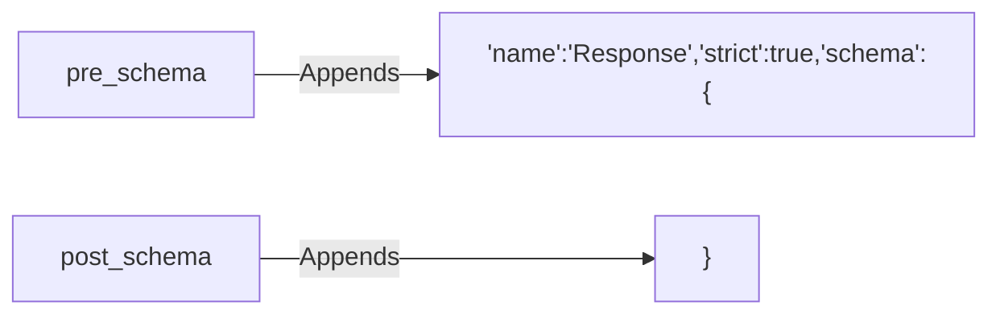

# Class ZCL_LLM_SO_JS_OA

AI Generated documentation.

## Overview  

`ZCL_LLM_SO_JS_OA` is a specialized implementation class for generating OpenAI-compatible JSON schemas. It inherits from `ZCL_LLM_SO_JS` and enhances schema generation through method redefinition.  

**Key Public Features**:  

- Inherits public interface from parent class `ZCL_LLM_SO_JS`  
- No additional public methods exposed  

**Core Interaction**:  
Uses protected method `append_to_schema` (inherited) to construct schema strings.  

## Dependencies  

- Inherits from `ZCL_LLM_SO_JS` (base JSON schema generator)  

## Details  

### Method Redefinition Logic  

The class implements two protected methods to wrap schema content in OpenAI-specific structures:  

**Key Implementation Notes**:  

1. **`PRE_SCHEMA`**:  
   - Inserts header with `Response` object definition and strict mode enforcement  
   - Triggers schema body generation in parent class  

2. **`POST_SCHEMA`**:  
   - Closes the schema structure after parent class completes content generation  

**Design Impact**:  

- Final class prevents further specialization  
- Tight coupling with parent class implementation expected
